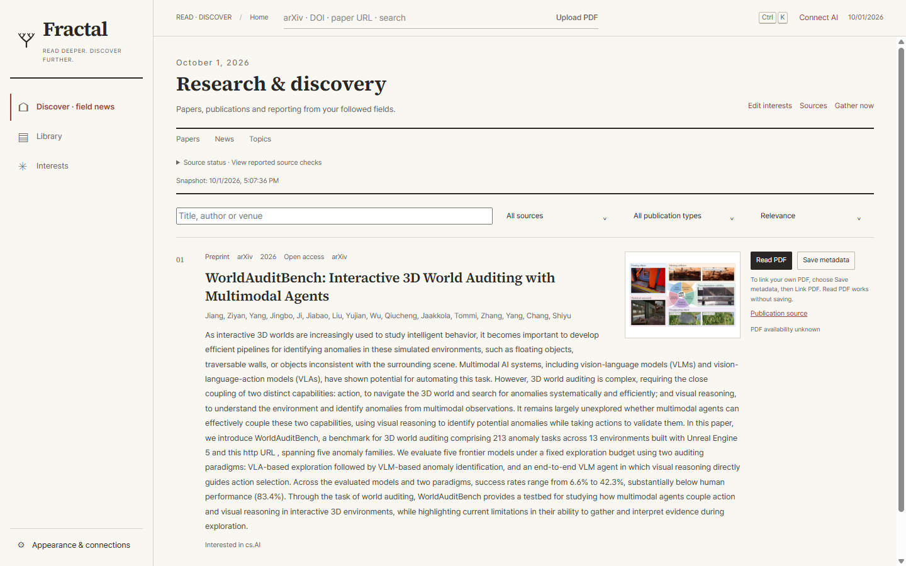
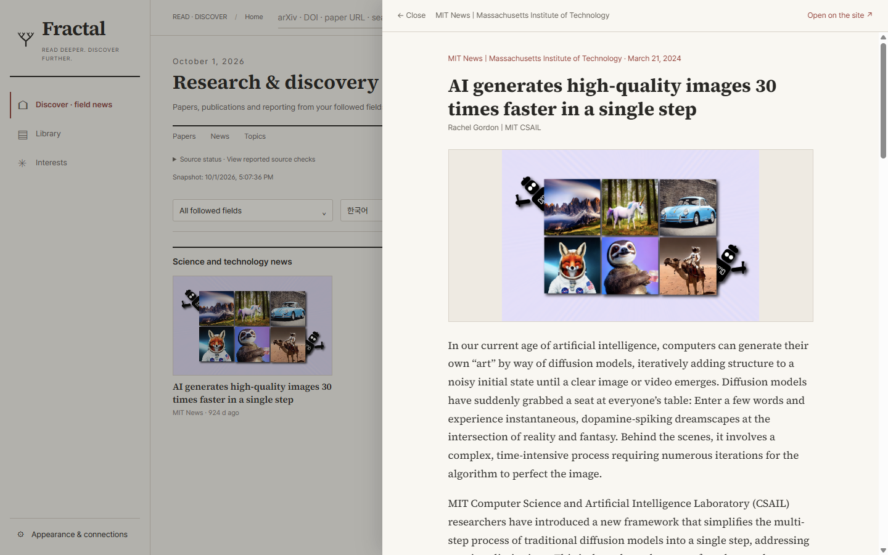
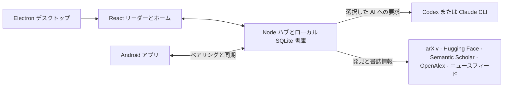

<p align="center"><a href="README.md">English</a> · <a href="README.ko.md">한국어</a> · <strong>日本語</strong> · <a href="README.zh-CN.md">简体中文</a></p>

<p align="center"><picture><source media="(prefers-color-scheme: dark)" srcset="docs/assets/readme/logo-dark.svg"></picture></p>

<h1 align="center">論文を深く読み、次の発見へ。</h1>

<p align="center">Codex または Claude のサブスクリプションで使える、論文リーダー・書庫・研究情報の拠点。</p>

<p align="center">
  
  
  
  
  
  
</p>

<p align="center"><a href="#クイックスタート">クイックスタート</a> · <a href="#主な機能">主な機能</a> · <a href="docs/">ドキュメント</a></p>

<p align="center">
  <a href="https://github.com/iwantgobackhome/news-papers/releases/tag/v0.2.4"></a>
  <a href="https://github.com/iwantgobackhome/news-papers/releases/tag/v0.2.4"></a>
  <a href="https://github.com/iwantgobackhome/news-papers/releases/tag/v0.2.4"></a>
  <a href="https://github.com/iwantgobackhome/news-papers/releases/tag/v0.2.4"></a>
  <a href="https://github.com/iwantgobackhome/news-papers/releases/latest"></a>
</p>



学術発見画面で論文とその科学図を一緒に確認できます。

**今読んでいる論文から、次に読むべき論文まで。** 原文 PDF と忠実な翻訳を並べて読み、疑問は論文に質問できます。回答に付いたページの引用から原文へ戻れます。専門分野の論文やニュースを追い、大切な資料は書庫に保存。現在利用している Codex または Claude CLI のサブスクリプションで接続でき、API キーの入力は不要です。

Windows と Linux のインストール済みアプリは、公開された GitHub リリースからアプリ内更新できます。Android は起動時と設定画面で更新を確認し、APK のチェックサムを検証します。macOS は新しい DMG をダウンロードして更新します。

## 主な機能

### 0.2.0 の研究ワークスペース

デスクトップとネイティブ Android の画面を、論文の読解と発見に合わせて整えました。Saved と Recent で保存済み資料と最近の読書を区別し、階層フォルダー、タグ、検索で書庫を整理します。質問と説明は状態や文脈を含む研究履歴として保存されます。ハイライト、手書き、移動できる付箋も論文に紐づいて残ります。

原文 PDF や訳文で必要な文字だけを正確に選択できます。公開 PDF が利用できる場合は主な読む操作から出版物の PDF をアプリ内で開きます。取得や抽出に失敗した場合は配信元ページを明示的な代替操作として提供します。原文、翻訳、並列表示で読書の文脈を保ちます。Android にはネイティブの News・Topics 画面と、記事の原文・訳文の分割表示もあります。

発見画面では、論文 HTML の最初の適切なキャプション付き図、またはニュース本文の最初の適切な画像を試します。取得できない場合は後続の適切な画像や情報源のサムネイルを試します。ロゴやプレースホルダーを除外し、検証済みの画像データをローカルに保存します。利用できる画像がなければ、テキストと読む操作を保ちます。画像の有無は情報源によって異なり、画像がなくても論文や PDF がないとは限りません。配布形式と機能の範囲は [0.2.0 リリースノート](docs/releases/0.2.0.md) を参照してください。


### 原文を見失わないリーダー

| 原文と翻訳                                                                                             | 論文への質問                                                                             |
| ------------------------------------------------------------------------------------------------------ | ---------------------------------------------------------------------------------------- |
| 原文と訳文を連動スクロールで読み進められます。翻訳先を切り替えても、別の言語で完了した翻訳は残ります。 | ページ引用を確かめながら質問できます。図・表・数式を選び、その部分の説明も求められます。 |

ハイライト、メモ、ペンや蛍光ペンによる書き込みにも対応。デスクトップアプリから訳文のみ、または原文と訳文を並べた PDF を書き出せます。書庫からは BibTeX、CSL-JSON、Markdown も出力できます。

| 詳細を理解する                                                            | 関連研究を探す                                                                           |
| ------------------------------------------------------------------------- | ---------------------------------------------------------------------------------------- |
| 読んでいる箇所で説明を開けます。                                          | 参考文献、引用文献、関連研究をたどれます。結果は外部の学術サービスの状態に左右されます。 |

### 使い続けられる書庫

arXiv ID、DOI、公開論文の URL、手元の PDF を開けます。保存した論文を検索し、コレクションやタグで整理。ハイライト、メモ、手書き、会話も論文と一緒に保存します。初回起動時には、旧 PaperRead の検証済みデータを元のファイルを変更せずに取り込みます。

### 専門分野の動きを追う

ホームには arXiv、Hugging Face Daily Papers、分野別ニュース、書庫に基づくおすすめが集まります。arXiv の全カテゴリ、著者、独自の検索分野をフォローできます。分野内では用意されたトピックや自分で作ったトピックを選び、関連ニュースを確認できます。

| 分野・トピック別ニュース                                         | 記事リーダー                                                                                                                             |
| ---------------------------------------------------------------- | ---------------------------------------------------------------------------------------------------------------------------------------- |
| 各分野で既存または個人のトピックをフォローできます。 | 対応する公開記事を読みやすいテキスト表示で開き、見出しや本文をすばやく翻訳できます。配信元の制限により本文を取得できない場合があります。 |



記事と本文画像をアプリ内で読み、配信元の原文もすぐに開けます。

### いつもの AI アカウントを使う

News Papers は公式の Codex・Claude CLI を通じて接続します。アプリからサインインを始めるか、ターミナルで使用中のログインを利用できます。管理対象の別アカウントを追加し、プロバイダーごとに有効なアカウントを切り替えることも可能です。対応する環境ではアプリから CLI のインストールとサインインを開始でき、非対応の環境では手動コマンドを案内します。既定モデルと機能別モデルも選べます。5 時間・週間の使用量はプロバイダーから取得できる場合に表示し、取得できなければその旨を示します。

### Android でも続きを読む

<p align="center"> </p>

実際の本文画像を使ったネイティブ Android の論文・ニュース発見画面です。

QR コードで Kotlin/Compose アプリをデスクトップのハブにペアリングします。信頼できる LAN または Tailscale 経由で、書庫や手書きを含む注釈を同期し、キャッシュ済み PDF を読めます。AI と発見機能はデスクトップのハブが担います。

### 好みの言語で読む

画面表示は韓国語と英語に対応。翻訳と回答には韓国語、英語、日本語、中国語の簡体字・繁体字、ドイツ語、フランス語、スペイン語などの BCP 47 言語タグを指定できます。翻訳結果は対象言語ごとに保存されます。

## 仕組み



デスクトップアプリはハブと画面を一緒に実行します。ハブだけを起動し、ループバックアドレスをブラウザーで開くこともできます。Android はペアリング後にハブへ接続します。

## クイックスタート

### ダウンロード

News Papers 0.2.4 は [リリースページ](https://github.com/iwantgobackhome/news-papers/releases/tag/v0.2.4) からダウンロードできます。下記からお使いの OS に合うファイルを選んでください。Windows・Linux・Android 版はアプリ内で更新できるようになりました。0.2.0 からは一度だけ手動でインストールしてください。0.2.1 からはアプリ内で更新できます。macOS は 0.2.3 から新しいバージョンを通知し、ダウンロードページを開きます。詳しくは [0.2.4 リリースノート](docs/releases/0.2.4.md) を参照してください。既存の [0.2.3](https://github.com/iwantgobackhome/news-papers/releases/tag/v0.2.3)・[0.2.2](https://github.com/iwantgobackhome/news-papers/releases/tag/v0.2.2)・[0.2.1](https://github.com/iwantgobackhome/news-papers/releases/tag/v0.2.1)・[0.2.0](https://github.com/iwantgobackhome/news-papers/releases/tag/v0.2.0)・[0.1.0](https://github.com/iwantgobackhome/news-papers/releases/tag/v0.1.0) リリースも維持されます。

| ファイル | プラットフォーム | 配布形式 |
| --- | --- | --- |
| [News-Papers-0.2.4-win-x64.exe](https://github.com/iwantgobackhome/news-papers/releases/download/v0.2.4/Fractal-0.2.4-win-x64.exe) | Windows x64 | NSIS インストーラー・未署名 |
| [News-Papers-0.2.4-linux-x64.AppImage](https://github.com/iwantgobackhome/news-papers/releases/download/v0.2.4/Fractal-0.2.4-linux-x64.AppImage) | Linux x64 | ポータブル AppImage |
| [News-Papers-0.2.4-linux-x64.deb](https://github.com/iwantgobackhome/news-papers/releases/download/v0.2.4/Fractal-0.2.4-linux-x64.deb) | Linux x64 | Debian パッケージ |
| [News-Papers-0.2.4-mac-arm64.dmg](https://github.com/iwantgobackhome/news-papers/releases/download/v0.2.4/Fractal-0.2.4-mac-arm64.dmg) | macOS Apple Silicon | 個別 DMG・ad-hoc 署名・公証なし |
| [News-Papers-0.2.4-mac-x64.dmg](https://github.com/iwantgobackhome/news-papers/releases/download/v0.2.4/Fractal-0.2.4-mac-x64.dmg) | macOS Intel | 個別 DMG・ad-hoc 署名・公証なし |
| [News-Papers-0.2.4-android-debug.apk](https://github.com/iwantgobackhome/news-papers/releases/download/v0.2.4/Fractal-0.2.4-android-debug.apk) | Android 10+ | デバッグ署名・versionCode 6 |

Windows は未署名です。Mac アプリは ad-hoc 署名で公証されておらず、Apple Silicon と Intel 用のファイルを個別に提供します。Android は 0.1.0 と同じデバッグ署名証明書を使用します。[SHA256SUMS.txt](https://github.com/iwantgobackhome/news-papers/releases/download/v0.2.4/SHA256SUMS.txt) でダウンロードを確認してください。検証の範囲は [配布手順](docs/RELEASING.md) を参照してください。

### ソースからビルド

**必要なもの:** Node.js 22.12 以降と npm。AI 機能には Codex または Claude CLI のインストールとサインインが必要です。対応環境では News Papers の設定画面から進められます。Android のビルドには JDK 17 と Android SDK も必要です。

リポジトリのルートで実行します。

```sh
npm ci
npm run desktop
```

`npm run desktop` は Windows、macOS、Linux でアプリをビルドして開きます。各 OS のホストで `npm run desktop:dist:win`、`npm run desktop:dist:linux`、`npm run desktop:dist:mac` を実行してください。出力先は `dist/installer/` でビルダーは `--publish never` を使用します。Mac のコマンドはホストのアーキテクチャをビルドし、CI は arm64 と x64 の個別 DMG を各アーキテクチャのホストでビルド・検証します。

デスクトップ画面を使わず、ハブとブラウザー画面を動かす場合:

```sh
npm run build
npm run hub
```

`http://127.0.0.1:7327/` を開きます。`PAPERREAD_PORT` でハブのポートを変更できます。Electron アプリは空いているポートを自動で選びます。

Android は Android Studio で `apps/android` を開くか、そのディレクトリでビルドします。

```sh
./gradlew :app:assembleDebug
```

Windows では `gradlew.bat :app:assembleDebug` を使います。`apps/android/app/build/outputs/apk/debug/app-debug.apk` を端末にインストールし、デスクトップの端末接続設定で LAN または Tailscale を有効にして QR コードを読み取ります。端末からハブのアドレスに到達できる必要があります。Android エミュレーターから見たホストは `10.0.2.4` です。

**保存先:** Windows は `%LOCALAPPDATA%\News Papers`、macOS などの Unix 系 OS は `${XDG_DATA_HOME:-~/.local/share}/news-papers` を使います。`FRACTAL_DATA` で変更できます。論文、PDF、アカウント設定、ペアリング情報をここに保存します。

## プライバシーと安全性

- 翻訳、質問、説明などの AI 操作を依頼すると、必要な論文テキストが**選択した** Codex または Claude CLI を通じてプロバイダーに送られます。News Papers は CLI にツールを使わない実行を求め、安全な分離を確認できない Codex 設定を拒否します。CLI の認証ファイルは直接読みません。サインインと要求は CLI が処理します。
- 論文やニュースの発見には外部のフィードと学術サービスから公開情報を取得します。記事を開くと配信元のページを取得します。ニュースの簡易翻訳は指定テキストを**非公式の Google Translate ウェブエンドポイント**へ送ります。このエンドポイントは停止する可能性があります。AI へのフォールバックを明示した場合は選択中のプロバイダーを利用できます。
- リモート端末にはペアリング用トークンを使います。通常の LAN 通信は **HTTP** です。信頼できるネットワークか Tailscale を利用してください。Tailscale は通信を暗号化しますが、ハブ自体に TLS はありません。必要なら `tailscale serve` で HTTPS を用意し、ペアリング後にその URL を設定できます。

要求の保護とトークンの扱いは [HTTP API](docs/API.md) を参照してください。

## 技術スタック

| 領域         | 技術                                      |
| ------------ | ----------------------------------------- |
| デスクトップ | Electron、React、TypeScript、Vite、PDF.js |
| ハブと保存   | Node.js、TypeScript、SQLite、FTS5         |
| Android      | Kotlin、Jetpack Compose、Room、CameraX    |
| AI           | Codex CLI、Claude CLI                     |

```text
apps/
  desktop/       Electron の画面、トレイ、内蔵ハブ
  android/       Kotlin リーダー、接続、キャッシュ、手書き
packages/
  shared/        API 契約、スキーマ、デザイントークン
  hub/           ローカル HTTP API、保存、発見、AI 接続
  ui/            React のホーム、書庫、PDF リーダー
```

## トラブルシューティング

<details>
<summary>AI が「未接続」と表示される</summary>

アプリの AI 設定を開き、対象 CLI のインストールとブラウザーでのサインインを確認してください。ターミナルでは `codex login status` / `claude auth status` を実行できます。アカウント画面から再ログインも可能です。AI 要求には利用可能なサブスクリプションとモデルが必要です。

</details>

<details>
<summary>Codex の「安全な実行環境」エラーが出る</summary>

ツールを使わない分離環境を確認できない場合、News Papers は生成を停止します。Codex の `config.toml` にある独自の指示や有効な MCP サーバーの設定を確認し、再試行してください。現在の保護策は [AI API の説明](docs/API.md) にあります。

</details>

<details>
<summary>ハブのポートが使用中</summary>

別のハブを終了するか、`npm run hub` の前に `PAPERREAD_PORT` を別の値にしてください。Electron アプリは空きポートを選びます。

</details>

<details>
<summary>Claude の使用上限を取得できない</summary>

News Papers は CLI が示す上限だけを読み取ります。対話型の使用量画面やターミナル機能が使えないときは数値を推測せず、「取得不可」と表示します。AI 要求自体は動作する場合があります。

</details>

<details>
<summary>Semantic Scholar が混雑している</summary>

外部サービスにより要求が制限された可能性があります。News Papers は OpenAlex を代わりに試し、両方から結果を取得できなければ再試行可能なエラーを返します。時間をおいて試してください。キャッシュ済みの結果はオフラインでも利用できます。

</details>

## コントリビュートとライセンス

Issue や範囲の明確なプルリクエストを歓迎します。[アーキテクチャ](docs/ARCHITECTURE.md)と [API](docs/API.md) を読み、コードを提出する前に `npm test` と `npm run typecheck` を実行してください。

News Papers は [Apache-2.0](LICENSE) で公開しています。[PaperRead](https://github.com/nkjunbc/PaperRead) を出発点としており、元の MIT ライセンス表示などは[サードパーティーの表示](THIRD_PARTY_NOTICES.md)にまとめています。
