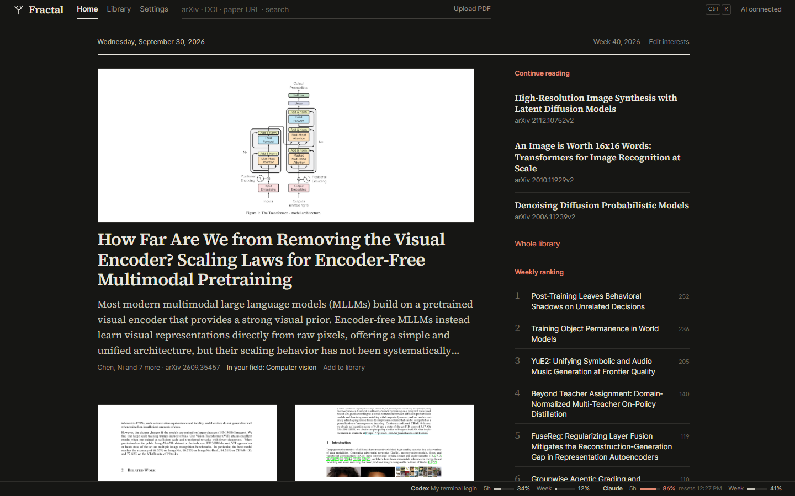
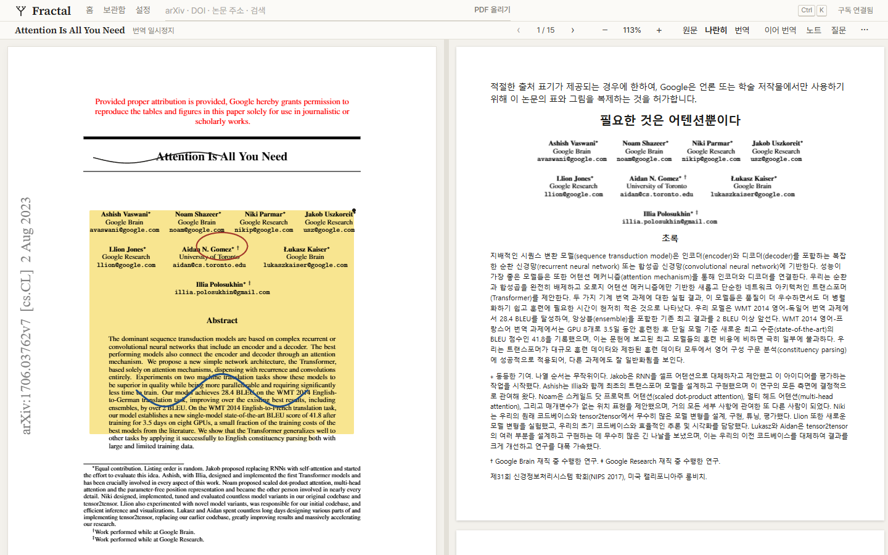
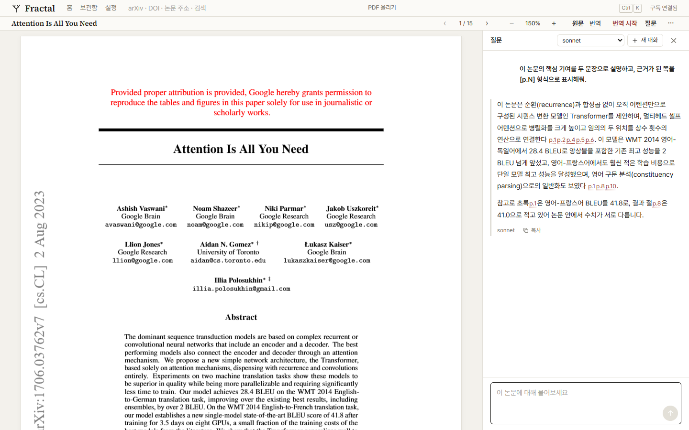
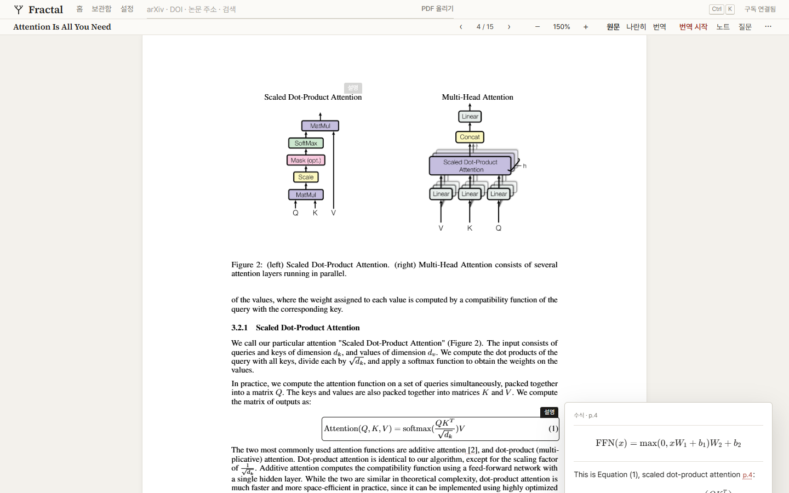
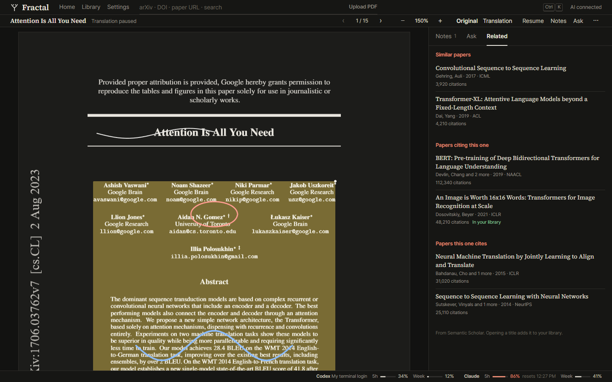
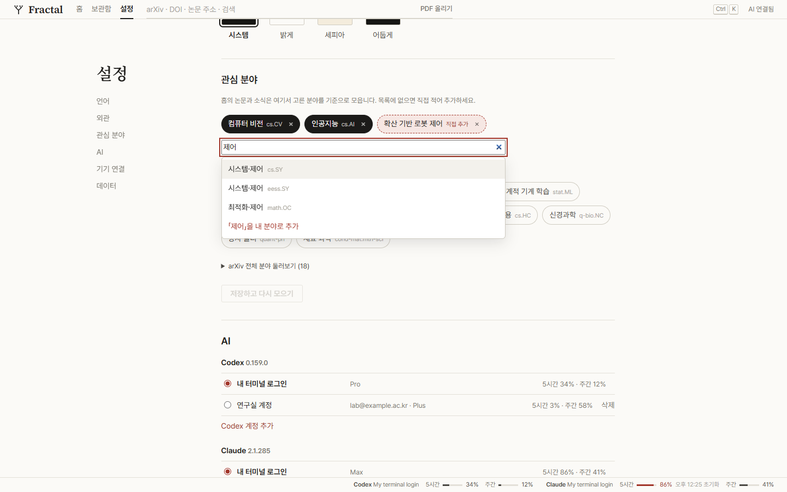
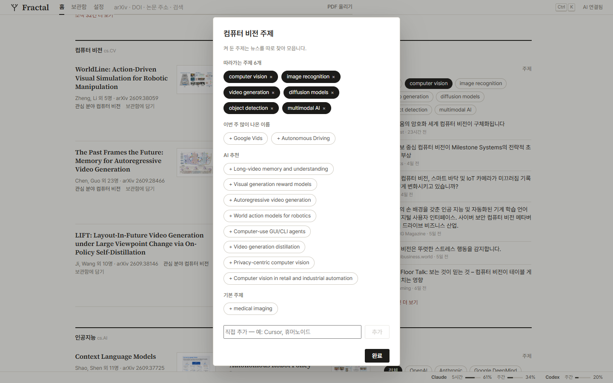
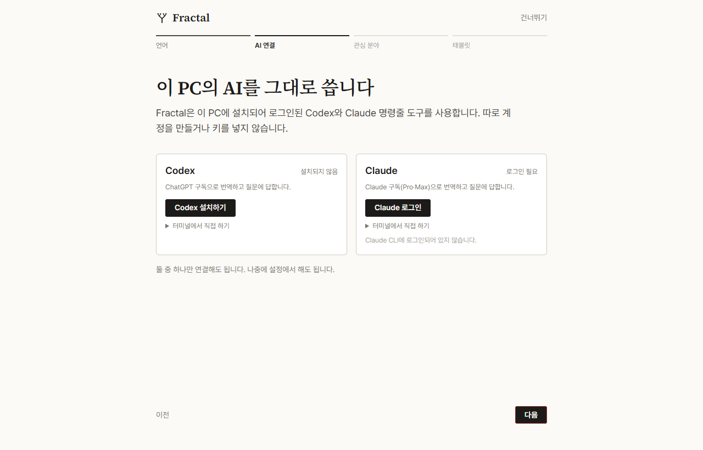
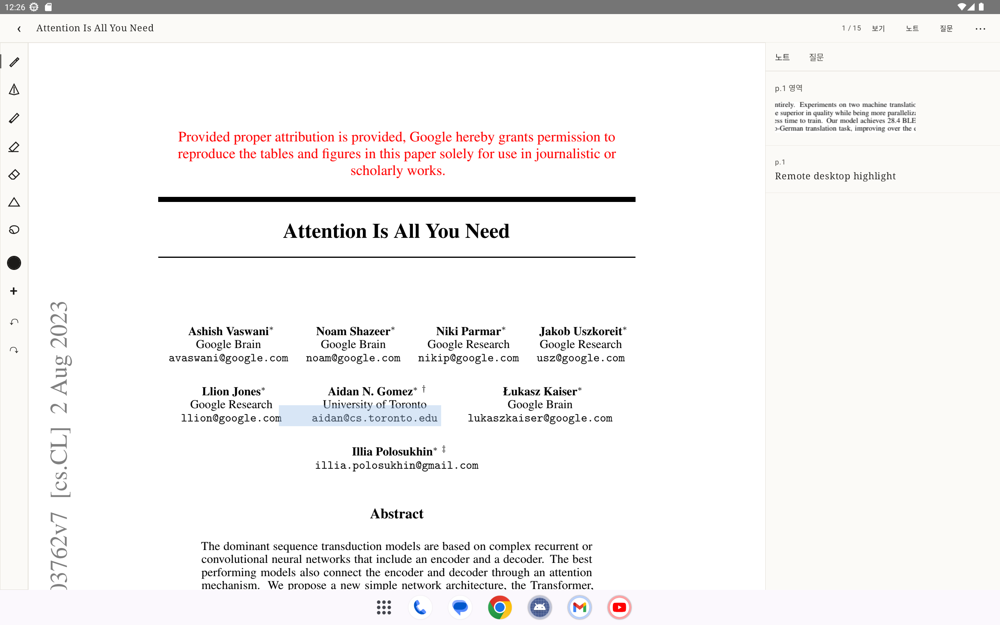
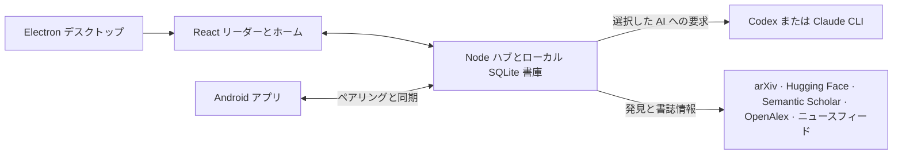

<p align="center"><a href="README.md">English</a> · <a href="README.ko.md">한국어</a> · <strong>日本語</strong> · <a href="README.zh-CN.md">简体中文</a></p>

<p align="center"><picture><source media="(prefers-color-scheme: dark)" srcset="docs/assets/readme/logo-dark.svg"></picture></p>

<h1 align="center">論文を深く読み、次の発見へ。</h1>

<p align="center">Codex または Claude のサブスクリプションで使える、論文リーダー・書庫・研究情報の拠点。</p>

<p align="center">
  
  
  
  
  
  
</p>

<p align="center"><a href="#クイックスタート">クイックスタート</a> · <a href="#主な機能">主な機能</a> · <a href="docs/">ドキュメント</a></p>



**今読んでいる論文から、次に読むべき論文まで。** 原文 PDF と忠実な翻訳を並べて読み、疑問は論文に質問できます。回答に付いたページの引用から原文へ戻れます。専門分野の論文やニュースを追い、大切な資料は書庫に保存。現在利用している Codex または Claude CLI のサブスクリプションで接続でき、API キーの入力は不要です。

## 主な機能

### 原文を見失わないリーダー

| 原文と翻訳                                                                                             | 論文への質問                                                                             |
| ------------------------------------------------------------------------------------------------------ | ---------------------------------------------------------------------------------------- |
|                     |                                |
| 原文と訳文を連動スクロールで読み進められます。翻訳先を切り替えても、別の言語で完了した翻訳は残ります。 | ページ引用を確かめながら質問できます。図・表・数式を選び、その部分の説明も求められます。 |

ハイライト、メモ、ペンや蛍光ペンによる書き込みにも対応。デスクトップアプリから訳文のみ、または原文と訳文を並べた PDF を書き出せます。書庫からは BibTeX、CSL-JSON、Markdown も出力できます。

| 詳細を理解する                                                            | 関連研究を探す                                                                           |
| ------------------------------------------------------------------------- | ---------------------------------------------------------------------------------------- |
|  |            |
| 読んでいる箇所で説明を開けます。                                          | 参考文献、引用文献、関連研究をたどれます。結果は外部の学術サービスの状態に左右されます。 |

### 使い続けられる書庫

arXiv ID、DOI、公開論文の URL、手元の PDF を開けます。保存した論文を検索し、コレクションやタグで整理。ハイライト、メモ、手書き、会話も論文と一緒に保存します。初回起動時には、旧 PaperRead の検証済みデータを元のファイルを変更せずに取り込みます。

### 専門分野の動きを追う



ホームには arXiv、Hugging Face Daily Papers、分野別ニュース、書庫に基づくおすすめが集まります。arXiv の全カテゴリ、著者、独自の検索分野をフォローできます。分野内では用意されたトピックや自分で作ったトピックを選び、関連ニュースを確認できます。

| 分野・トピック別ニュース                                         | 記事リーダー                                                                                                                             |
| ---------------------------------------------------------------- | ---------------------------------------------------------------------------------------------------------------------------------------- |
|  | 対応する公開記事を読みやすいテキスト表示で開き、見出しや本文をすばやく翻訳できます。配信元の制限により本文を取得できない場合があります。 |

### いつもの AI アカウントを使う



Fractal は公式の Codex・Claude CLI を通じて接続します。アプリからサインインを始めるか、ターミナルで使用中のログインを利用できます。管理対象の別アカウントを追加し、プロバイダーごとに有効なアカウントを切り替えることも可能です。対応する環境ではアプリから CLI のインストールとサインインを開始でき、非対応の環境では手動コマンドを案内します。既定モデルと機能別モデルも選べます。5 時間・週間の使用量はプロバイダーから取得できる場合に表示し、取得できなければその旨を示します。

### Android でも続きを読む



QR コードで Kotlin/Compose アプリをデスクトップのハブにペアリングします。信頼できる LAN または Tailscale 経由で、書庫や手書きを含む注釈を同期し、キャッシュ済み PDF を読めます。AI と発見機能はデスクトップのハブが担います。

### 好みの言語で読む

画面表示は韓国語と英語に対応。翻訳と回答には韓国語、英語、日本語、中国語の簡体字・繁体字、ドイツ語、フランス語、スペイン語などの BCP 47 言語タグを指定できます。翻訳結果は対象言語ごとに保存されます。

## 仕組み



デスクトップアプリはハブと画面を一緒に実行します。ハブだけを起動し、ループバックアドレスをブラウザーで開くこともできます。Android はペアリング後にハブへ接続します。

## クイックスタート

**必要なもの:** Node.js 22.12 以降と npm。AI 機能には Codex または Claude CLI のインストールとサインインが必要です。対応環境では Fractal の設定画面から進められます。Android のビルドには JDK 17 と Android SDK も必要です。

リポジトリのルートで実行します。

```sh
npm ci
npm run desktop
```

`npm run desktop` はアプリをビルドし、Windows または macOS で開きます。Windows では `npm run desktop:dist` で NSIS インストーラーを作成でき、出力先は `dist/installer/` です。macOS DMG のターゲットも設定されていますが、このコマンドが作るのは Windows 用です。

デスクトップ画面を使わず、ハブとブラウザー画面を動かす場合:

```sh
npm run build
npm run hub
```

`http://127.0.0.1:7327/` を開きます。`PAPERREAD_PORT` でハブのポートを変更できます。Electron アプリは空いているポートを自動で選びます。

Android は Android Studio で `apps/android` を開くか、そのディレクトリでビルドします。

```sh
./gradlew :app:assembleDebug
```

Windows では `gradlew.bat :app:assembleDebug` を使います。`apps/android/app/build/outputs/apk/debug/app-debug.apk` を端末にインストールし、デスクトップの端末接続設定で LAN または Tailscale を有効にして QR コードを読み取ります。端末からハブのアドレスに到達できる必要があります。Android エミュレーターから見たホストは `10.0.2.2` です。

**保存先:** Windows は `%LOCALAPPDATA%\Fractal`、macOS などの Unix 系 OS は `${XDG_DATA_HOME:-~/.local/share}/fractal` を使います。`FRACTAL_DATA` で変更できます。論文、PDF、アカウント設定、ペアリング情報をここに保存します。

## プライバシーと安全性

- 翻訳、質問、説明などの AI 操作を依頼すると、必要な論文テキストが**選択した** Codex または Claude CLI を通じてプロバイダーに送られます。Fractal は CLI にツールを使わない実行を求め、安全な分離を確認できない Codex 設定を拒否します。CLI の認証ファイルは直接読みません。サインインと要求は CLI が処理します。
- 論文やニュースの発見には外部のフィードと学術サービスから公開情報を取得します。記事を開くと配信元のページを取得します。ニュースの簡易翻訳は指定テキストを**非公式の Google Translate ウェブエンドポイント**へ送ります。このエンドポイントは停止する可能性があります。AI へのフォールバックを明示した場合は選択中のプロバイダーを利用できます。
- リモート端末にはペアリング用トークンを使います。通常の LAN 通信は **HTTP** です。信頼できるネットワークか Tailscale を利用してください。Tailscale は通信を暗号化しますが、ハブ自体に TLS はありません。必要なら `tailscale serve` で HTTPS を用意し、ペアリング後にその URL を設定できます。

要求の保護とトークンの扱いは [HTTP API](docs/API.md) を参照してください。

## 技術スタック

| 領域         | 技術                                      |
| ------------ | ----------------------------------------- |
| デスクトップ | Electron、React、TypeScript、Vite、PDF.js |
| ハブと保存   | Node.js、TypeScript、SQLite、FTS5         |
| Android      | Kotlin、Jetpack Compose、Room、CameraX    |
| AI           | Codex CLI、Claude CLI                     |

```text
apps/
  desktop/       Electron の画面、トレイ、内蔵ハブ
  android/       Kotlin リーダー、接続、キャッシュ、手書き
packages/
  shared/        API 契約、スキーマ、デザイントークン
  hub/           ローカル HTTP API、保存、発見、AI 接続
  ui/            React のホーム、書庫、PDF リーダー
```

## トラブルシューティング

<details>
<summary>AI が「未接続」と表示される</summary>

アプリの AI 設定を開き、対象 CLI のインストールとブラウザーでのサインインを確認してください。ターミナルでは `codex login status` / `claude auth status` を実行できます。アカウント画面から再ログインも可能です。AI 要求には利用可能なサブスクリプションとモデルが必要です。

</details>

<details>
<summary>Codex の「安全な実行環境」エラーが出る</summary>

ツールを使わない分離環境を確認できない場合、Fractal は生成を停止します。Codex の `config.toml` にある独自の指示や有効な MCP サーバーの設定を確認し、再試行してください。現在の保護策は [AI API の説明](docs/API.md) にあります。

</details>

<details>
<summary>ハブのポートが使用中</summary>

別のハブを終了するか、`npm run hub` の前に `PAPERREAD_PORT` を別の値にしてください。Electron アプリは空きポートを選びます。

</details>

<details>
<summary>Claude の使用上限を取得できない</summary>

Fractal は CLI が示す上限だけを読み取ります。対話型の使用量画面やターミナル機能が使えないときは数値を推測せず、「取得不可」と表示します。AI 要求自体は動作する場合があります。

</details>

<details>
<summary>Semantic Scholar が混雑している</summary>

外部サービスにより要求が制限された可能性があります。Fractal は OpenAlex を代わりに試し、両方から結果を取得できなければ再試行可能なエラーを返します。時間をおいて試してください。キャッシュ済みの結果はオフラインでも利用できます。

</details>

## コントリビュートとライセンス

Issue や範囲の明確なプルリクエストを歓迎します。[アーキテクチャ](docs/ARCHITECTURE.md)と [API](docs/API.md) を読み、コードを提出する前に `npm test` と `npm run typecheck` を実行してください。

Fractal は [Apache-2.0](LICENSE) で公開しています。[PaperRead](https://github.com/nkjunbc/PaperRead) を出発点としており、元の MIT ライセンス表示などは[サードパーティーの表示](THIRD_PARTY_NOTICES.md)にまとめています。
