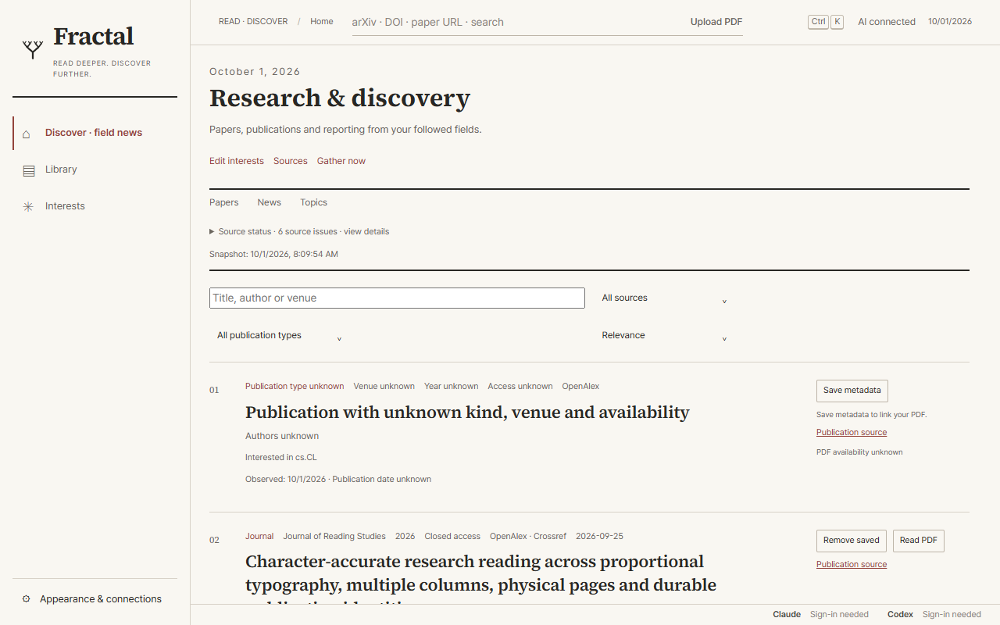
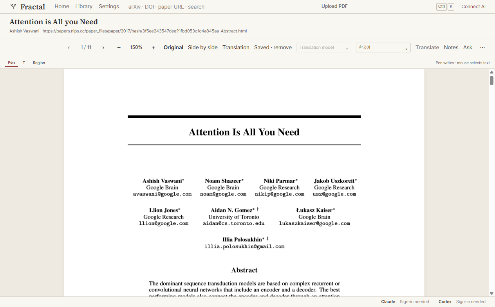
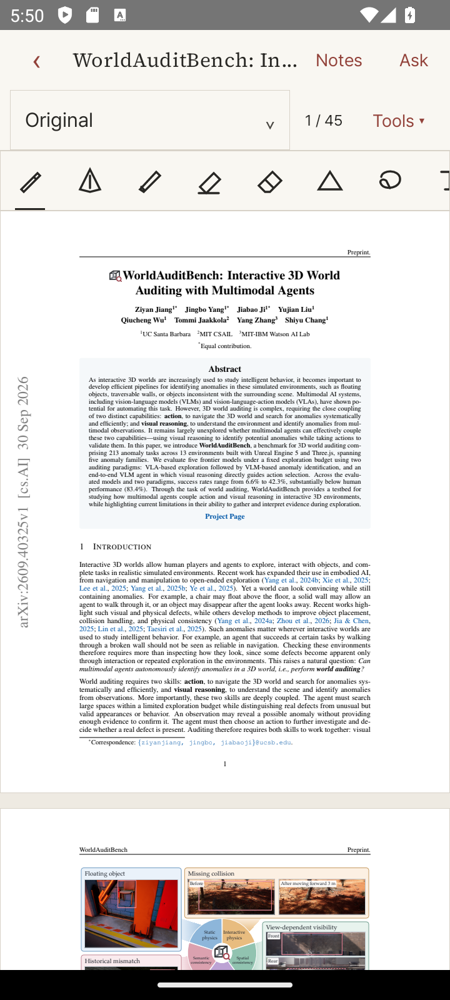
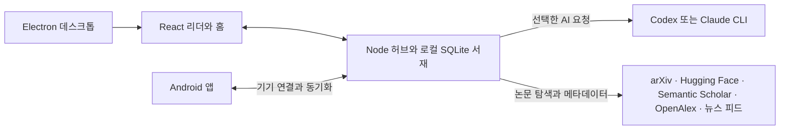

<p align="center"><a href="README.md">English</a> · <strong>한국어</strong> · <a href="README.ja.md">日本語</a> · <a href="README.zh-CN.md">简体中文</a></p>

<p align="center"><picture><source media="(prefers-color-scheme: dark)" srcset="docs/assets/readme/logo-dark.svg"></picture></p>

<h1 align="center">논문은 깊이 읽고, 다음 발견은 더 빠르게.</h1>

<p align="center">구독 중인 Codex 또는 Claude로 논문 읽기, 서재 정리, 연구 동향 탐색을 한곳에서.</p>

<p align="center">
  
  
  
  
  
  
</p>

<p align="center"><a href="#빠른-시작">빠른 시작</a> · <a href="#주요-기능">주요 기능</a> · <a href="docs/">문서</a></p>

<p align="center">
  <a href="https://github.com/iwantgobackhome/fractal/releases/latest"></a>
  <a href="https://github.com/iwantgobackhome/fractal/releases/latest"></a>
  <a href="https://github.com/iwantgobackhome/fractal/releases/latest"></a>
  <a href="https://github.com/iwantgobackhome/fractal/releases/latest"></a>
  <a href="https://github.com/iwantgobackhome/fractal/releases/latest"></a>
</p>



**눈앞의 논문에서 다음에 읽을 논문까지.** 원문 PDF와 충실한 번역을 나란히 놓고 읽으세요. 궁금한 점은 논문에 묻고, 답변의 페이지 인용을 따라 원문을 확인하세요. 관심 분야의 논문과 뉴스를 살펴보고 중요한 자료는 서재에 담을 수 있습니다. 이미 이용 중인 Codex 또는 Claude CLI 구독 계정으로 연결하며, API 키를 따로 입력할 필요가 없습니다.

## 주요 기능

### 0.2.0의 학술 작업 공간

데스크톱과 네이티브 Android 화면을 학술 읽기와 탐색에 맞춰 구성했습니다. 저장됨(Saved)과 최근 읽음(Recent)을 구분하고 중첩 폴더·태그·검색으로 서재를 정리합니다. 질문과 설명은 상태와 문맥을 포함한 연구 기록으로 영구 보관합니다. 하이라이트, 필기, 이동 가능한 스티키 노트도 논문에 연결해 저장합니다.

원문 PDF나 번역문에서 필요한 글자만 정확히 선택할 수 있습니다. 공개 PDF가 있으면 기본 읽기 동작으로 앱 안에서 출판물 PDF를 엽니다. 접근이나 추출에 실패하면 발행처 페이지는 명시적인 대체 동작으로 제공됩니다. 원문·번역·나란히 보기에서도 읽기 문맥을 유지합니다. Android에는 네이티브 뉴스·주제 화면과 기사 원문·번역 분할 읽기도 있습니다.

탐색에서는 논문 HTML의 첫 적합한 캡션 그림이나 뉴스 기사의 첫 적합한 본문 이미지를 먼저 시도합니다. 후보를 가져오지 못하면 뒤의 적합한 이미지와 출처 썸네일을 시도합니다. 로고와 자리표시자는 제외하고 검증된 이미지 바이트를 로컬에 캐시합니다. 사용 가능한 이미지가 없으면 텍스트와 읽기 동작을 그대로 제공합니다. 이미지 제공 여부는 출처에 따라 다르며, 이미지가 없다고 논문이나 PDF도 없는 것은 아닙니다. 배포 대상과 기능 범위는 [0.2.0 릴리스 노트](docs/releases/0.2.0.md)를 참고하세요.



### 원문을 놓치지 않는 리더

| 원문과 번역을 함께                                                                                 | 논문에 질문하기                                                                                  |
| -------------------------------------------------------------------------------------------------- | ------------------------------------------------------------------------------------------------ |
| 두 화면의 스크롤을 맞춰 읽습니다. 번역 언어를 바꾸어도 다른 언어로 완료한 번역은 보존됩니다.       | 답변에 달린 페이지 인용을 확인하고, 그림·표·수식을 선택해 해당 부분의 설명을 요청할 수 있습니다. |

중요한 구절을 형광펜으로 표시하고 메모를 남기거나 펜으로 필기할 수 있습니다. 데스크톱에서는 번역문만, 또는 원문과 번역문을 나란히 담은 PDF로 내보낼 수 있습니다. 서재에서는 BibTeX, CSL-JSON, Markdown도 내보냅니다.

| 수식과 그림 이해하기                                                       | 관련 연구 이어 읽기                                                                                         |
| -------------------------------------------------------------------------- | ----------------------------------------------------------------------------------------------------------- |
| 읽던 자리에서 바로 설명을 펼칩니다.                                        | 참고문헌, 인용 논문, 관련 연구를 살펴봅니다. 외부 학술 서비스의 응답 상태에 따라 결과가 달라질 수 있습니다. |

### 쌓아 두는 데 그치지 않는 서재

arXiv ID, DOI, 공개 논문 주소, 로컬 PDF를 열 수 있습니다. 저장한 논문을 검색하고 컬렉션과 태그로 정리하세요. 하이라이트, 메모, 필기, 대화도 논문과 함께 보관합니다. 첫 실행 시 기존 PaperRead 데이터 중 검증된 항목을 가져오며 원본은 수정하지 않습니다.

### 내 연구 분야 따라가기

홈 피드에서 arXiv 논문, Hugging Face Daily Papers, 분야별 뉴스와 서재를 바탕으로 한 추천을 모아 봅니다. arXiv 전체 분류에서 관심 분야를 고르거나 저자와 직접 만든 검색 분야를 팔로우하세요. 분야 안에서는 기본 제공 주제와 나만의 주제를 따라가며 주제별 뉴스를 볼 수 있습니다.

| 분야와 주제별 뉴스                                                 | 기사 읽기                                                                                                                                  |
| ------------------------------------------------------------------ | ------------------------------------------------------------------------------------------------------------------------------------------ |
| 관심 분야에서 기본 제공 주제와 개인 주제를 팔로우합니다. | 공개 기사를 앱 안의 간결한 텍스트 화면에서 읽고 제목과 본문을 빠르게 번역할 수 있습니다. 언론사 제한으로 본문을 가져오지 못할 수 있습니다. |

### 쓰던 AI 계정 그대로

Fractal은 공식 Codex·Claude CLI로 연결합니다. 앱에서 로그인을 시작하거나 터미널의 기존 로그인을 사용할 수 있고, 별도 관리 계정을 추가해 제공자별 활성 계정을 바꿀 수 있습니다. 지원되는 환경에서는 설치와 로그인을 앱에서 시작하며, 자동 설치가 안 되면 직접 실행할 명령을 안내합니다. 기본 모델과 기능별 모델을 고를 수 있습니다. 5시간·주간 사용량은 제공자가 알려 줄 때만 표시하고, 확인할 수 없으면 그대로 알립니다.

### Android 태블릿에서도 이어서

<p align="center"></p>

QR 코드를 스캔해 Kotlin/Compose 앱을 데스크톱 허브에 연결합니다. 신뢰할 수 있는 LAN 또는 Tailscale을 통해 서재와 펜 필기를 포함한 주석을 동기화하고, 캐시된 PDF를 읽을 수 있습니다. AI와 탐색 기능은 데스크톱 허브에서 처리합니다.

### 읽기 편한 언어로

화면 언어는 한국어와 영어를 지원합니다. 번역·답변 언어로는 한국어, 영어, 일본어, 중국어 간체·번체, 독일어, 프랑스어, 스페인어 등 BCP 47 언어 태그를 지정할 수 있습니다. 번역 결과는 목표 언어별로 저장됩니다.

## 작동 방식



데스크톱 앱은 허브와 화면을 함께 실행합니다. 허브만 실행한 뒤 로컬 주소를 브라우저로 열 수도 있습니다. Android 앱은 QR 연결 후 허브에 접속합니다.

## 빠른 시작

### 내려받기

공개 빌드는 [릴리스 페이지](https://github.com/iwantgobackhome/fractal/releases/latest)에서 받습니다. 0.2.0 파이프라인은 아래 파일을 준비하며 플랫폼 검증과 릴리스 승인 후 내려받을 수 있습니다. 기존 0.1.0 릴리스는 유지됩니다.

| 파일 | 플랫폼 | 배포 형식 |
| --- | --- | --- |
| `Fractal-0.2.0-win-x64.exe` | Windows x64 | NSIS 설치 파일 · 서명 없음 |
| `Fractal-0.2.0-linux-x64.AppImage` | Linux x64 | 포터블 AppImage |
| `Fractal-0.2.0-linux-x64.deb` | Linux x64 | Debian 패키지 |
| `Fractal-0.2.0-mac-arm64.dmg` | macOS Apple Silicon | 별도 DMG · 기본 ad-hoc 서명 |
| `Fractal-0.2.0-mac-x64.dmg` | macOS Intel | 별도 DMG · 기본 ad-hoc 서명 |
| `Fractal-0.2.0-android-debug.apk` | Android 10+ | 디버그 서명 앱 · versionCode 2 |

macOS 정식 서명·공증에는 설정된 릴리스 자격 증명이 필요하며 ad-hoc 빌드는 공증되지 않습니다. 검증된 배포에는 `SHA256SUMS.txt`가 포함됩니다. 플랫폼별 빌드·검증은 [배포 안내](docs/RELEASING.md)를 참고하세요.

### 소스에서 빌드하기

**준비물:** Node.js 22.12 이상과 npm. AI 기능에는 Codex 또는 Claude CLI 설치 및 로그인이 필요하며, 지원되는 환경에서는 Fractal의 설정 화면에서 진행할 수 있습니다. Android 빌드에는 JDK 17과 Android SDK도 필요합니다.

저장소 루트에서 실행하세요.

```sh
npm ci
npm run desktop
```

`npm run desktop`은 Windows·macOS·Linux에서 앱을 빌드하고 엽니다. 해당 운영체제의 호스트에서 `npm run desktop:dist:win`, `npm run desktop:dist:linux`, `npm run desktop:dist:mac`을 사용하세요. 출력은 `dist/installer/`에 생성되며 빌더는 `--publish never`를 사용합니다. Mac 명령은 호스트 아키텍처를 빌드하고 CI는 arm64·x64 DMG를 각각 해당 아키텍처의 호스트에서 빌드·검증합니다.

데스크톱 창 없이 허브와 브라우저 화면만 실행하려면:

```sh
npm run build
npm run hub
```

`http://127.0.0.1:7327/`을 여세요. 허브 포트는 `PAPERREAD_PORT`로 바꿀 수 있습니다. Electron 앱은 사용 가능한 포트를 자동으로 고릅니다.

Android는 Android Studio에서 `apps/android`를 열거나 해당 디렉터리에서 빌드하세요.

```sh
./gradlew :app:assembleDebug
```

Windows에서는 `gradlew.bat :app:assembleDebug`를 사용합니다. `apps/android/app/build/outputs/apk/debug/app-debug.apk`를 기기에 설치하고 데스크톱의 기기 연결 설정에서 LAN 또는 Tailscale을 켠 뒤 QR 코드를 스캔하세요. 기기에서 허브 주소에 접속할 수 있어야 합니다. Android 에뮬레이터에서 호스트 주소는 `10.0.2.2`입니다.

**데이터 위치:** Windows는 `%LOCALAPPDATA%\Fractal`, macOS와 기타 Unix 시스템은 `${XDG_DATA_HOME:-~/.local/share}/fractal`을 사용합니다. `FRACTAL_DATA`로 위치를 바꿀 수 있습니다. 논문, PDF, 계정 설정, 연결 기록이 이곳에 저장됩니다.

## 개인정보와 안전

- 번역·질문·설명 등 AI 작업을 요청하면 필요한 논문 텍스트가 **선택한** Codex 또는 Claude CLI를 통해 해당 제공자에게 전달됩니다. Fractal은 도구를 쓰지 않는 CLI 실행을 요청하고, 안전한 격리를 확인할 수 없는 Codex 설정은 거부합니다. CLI 인증 파일은 직접 읽지 않으며 로그인과 요청은 CLI가 처리합니다.
- 탐색 기능은 외부 논문·뉴스·학술 서비스에 공개 정보를 요청합니다. 기사를 열면 해당 발행처의 페이지를 가져옵니다. 빠른 뉴스 번역은 요청한 텍스트를 **비공식 Google Translate 웹 엔드포인트**로 보내며, 이 서비스는 예고 없이 작동이 멈출 수 있습니다. 명시적으로 AI 대체 경로를 선택한 경우에는 선택한 제공자를 사용할 수 있습니다.
- 원격 기기는 연결 토큰을 사용합니다. 일반 LAN 연결은 **HTTP**이므로 신뢰할 수 있는 네트워크나 Tailscale을 사용하세요. Tailscale은 통신을 암호화하지만 허브 자체는 TLS를 제공하지 않습니다. 원한다면 `tailscale serve`로 HTTPS를 구성하고 연결 후 해당 주소를 지정할 수 있습니다.

요청 보호 방식과 토큰 처리에 관한 자세한 내용은 [HTTP API 문서](docs/API.md)를 참고하세요.

## 기술 구성

| 영역          | 기술                                      |
| ------------- | ----------------------------------------- |
| 데스크톱      | Electron, React, TypeScript, Vite, PDF.js |
| 허브와 저장소 | Node.js, TypeScript, SQLite, FTS5         |
| Android       | Kotlin, Jetpack Compose, Room, CameraX    |
| AI            | Codex CLI, Claude CLI                     |

```text
apps/
  desktop/       Electron 창, 트레이, 내장 허브
  android/       Kotlin 리더, 기기 연결, 캐시, 필기
packages/
  shared/        API 계약, 스키마, 디자인 토큰
  hub/           로컬 HTTP API, 저장소, 탐색, AI 연결
  ui/            React 홈, 서재, PDF 리더
```

## 문제 해결

<details>
<summary>AI가 연결되지 않았다고 표시됩니다</summary>

앱의 AI 설정에서 선택한 CLI가 설치되어 있고 브라우저 로그인이 끝났는지 확인하세요. 터미널에서는 `codex login status` 또는 `claude auth status`로 확인할 수 있습니다. 계정 패널에서 로그인을 다시 시도할 수도 있습니다. AI 요청에는 사용할 수 있는 구독과 모델이 필요합니다.

</details>

<details>
<summary>Codex의 ‘안전한 실행 환경’ 오류가 뜹니다</summary>

Fractal은 도구 없는 격리 실행을 확인하지 못하면 생성을 중단합니다. Codex `config.toml`의 사용자 지정 지시문과 활성 MCP 서버 설정을 확인한 뒤 다시 시도하세요. 현재 보호 장치는 [AI API 문서](docs/API.md)에 정리되어 있습니다.

</details>

<details>
<summary>허브 포트를 이미 사용 중입니다</summary>

다른 허브를 종료하거나 `npm run hub` 실행 전에 `PAPERREAD_PORT`를 다른 값으로 지정하세요. Electron 앱은 빈 포트를 자동으로 고릅니다.

</details>

<details>
<summary>Claude 사용 한도를 확인할 수 없습니다</summary>

Fractal은 CLI에서 제공하는 한도만 읽습니다. 대화형 사용량 화면이나 터미널 지원을 이용할 수 없으면 수치를 추측하지 않고 확인 불가로 표시합니다. AI 요청은 계속 동작할 수 있습니다.

</details>

<details>
<summary>Semantic Scholar가 바쁘다고 나옵니다</summary>

외부 서비스가 요청을 제한했을 수 있습니다. Fractal은 OpenAlex로 다시 시도하며, 두 곳 모두 결과를 줄 수 없으면 재시도 가능한 오류를 반환합니다. 잠시 후 다시 시도하세요. 캐시된 결과는 오프라인에서도 볼 수 있습니다.

</details>

## 기여와 라이선스

이슈와 범위가 분명한 풀 리퀘스트를 환영합니다. 코드 변경 전 [아키텍처](docs/ARCHITECTURE.md)와 [API](docs/API.md)를 살펴보고, 제출 전 `npm test`와 `npm run typecheck`를 실행해 주세요.

Fractal은 [Apache-2.0](LICENSE) 라이선스로 배포됩니다. [PaperRead](https://github.com/nkjunbc/PaperRead)에서 출발했으며, 원본의 MIT 고지와 다른 저작권 표기는 [서드파티 고지](THIRD_PARTY_NOTICES.md)에 담았습니다.
