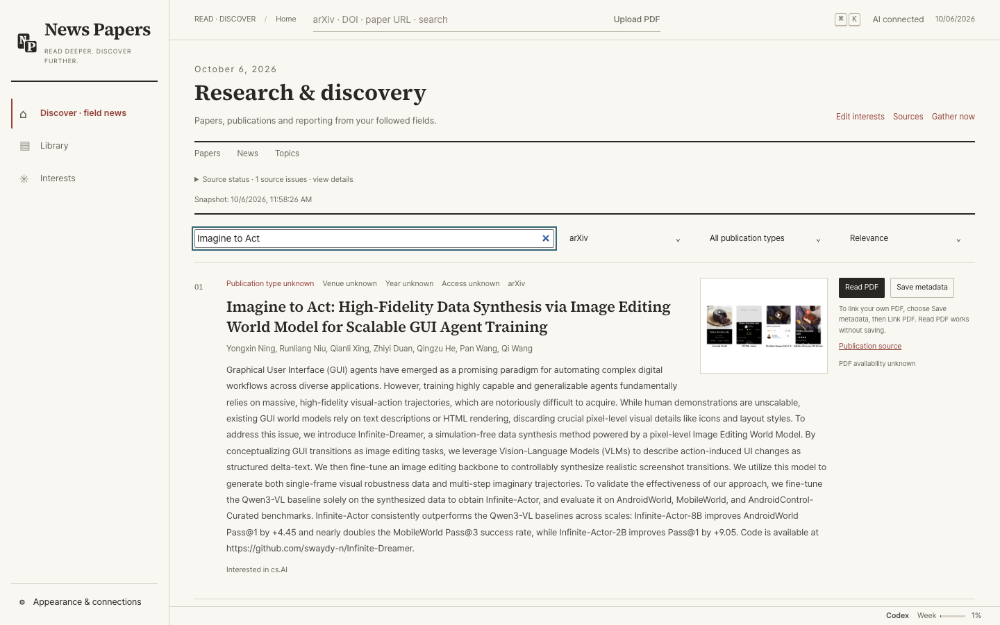
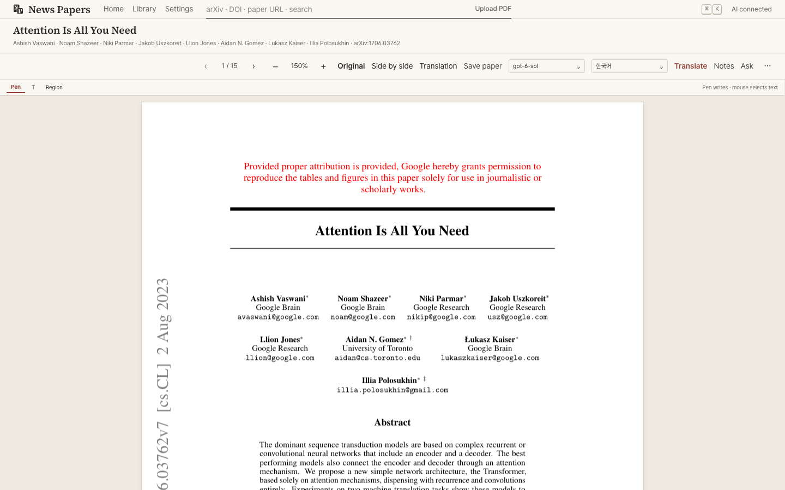
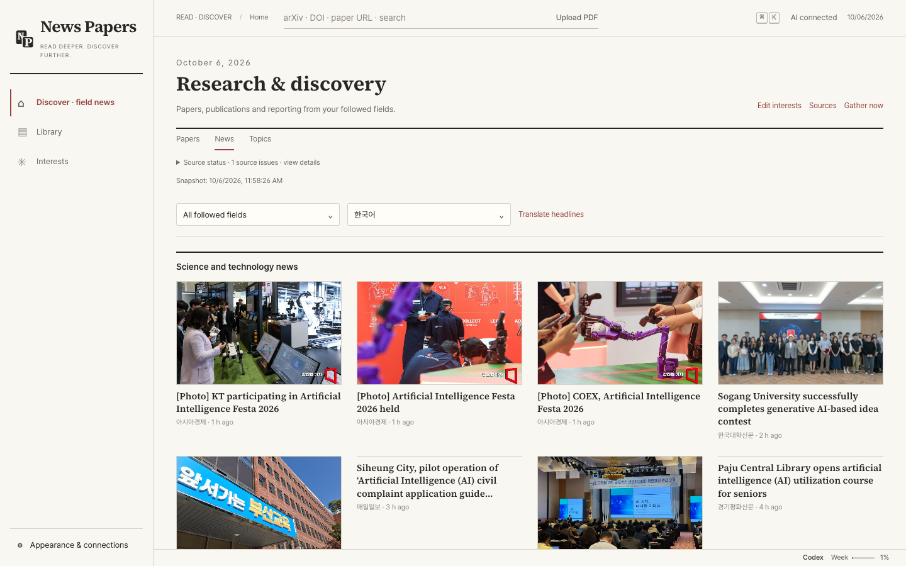
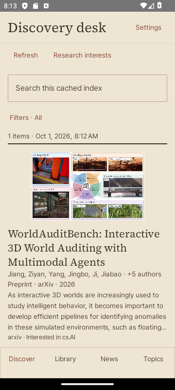
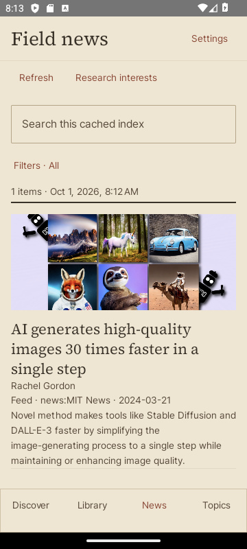
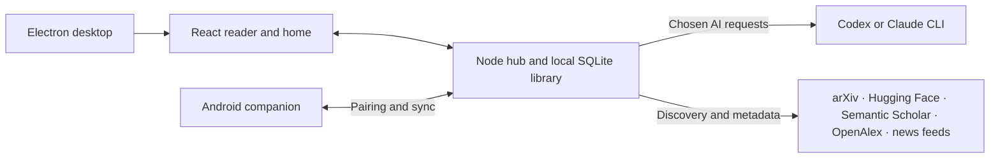

<p align="center"><strong>English</strong> · <a href="README.ko.md">한국어</a> · <a href="README.ja.md">日本語</a> · <a href="README.zh-CN.md">简体中文</a></p>

<p align="center"><picture><source media="(prefers-color-scheme: dark)" srcset="docs/assets/readme/logo-dark.svg"></picture></p>

<h1 align="center">Read deeper. Discover further.</h1>

<p align="center">A research reader, library, and discovery desk powered by your Codex or Claude subscription.</p>

<p align="center">
  
  
  
  
  
  
</p>

<p align="center"><a href="#quick-start">Quick start</a> · <a href="#features">Features</a> · <a href="docs/">Docs</a></p>

<p align="center">
  <a href="https://github.com/iwantgobackhome/news-papers/releases/tag/v0.4.2"></a>
  <a href="https://github.com/iwantgobackhome/news-papers/releases/tag/v0.4.2"></a>
  <a href="https://github.com/iwantgobackhome/news-papers/releases/tag/v0.4.2"></a>
  <a href="https://github.com/iwantgobackhome/news-papers/releases/tag/v0.4.2"></a>
  <a href="https://github.com/iwantgobackhome/news-papers/releases/latest"></a>
</p>



A paper and its scientific figure in the scholarly discovery desk.

**From the paper in front of you to the next one worth reading.** Put the original PDF beside a faithful translation. Ask questions and follow answers back to cited pages. Track papers and news in your fields, then save what matters. News Papers uses the Codex or Claude CLI sign-in tied to your existing subscription; you do not need to supply an API key.

Windows and Linux installations offer in-app updates from published GitHub releases; Android offers updates at startup and in Settings, with APK checksum verification. macOS updates use the downloaded DMG.

## Features

### A scholarly workspace in 0.2.0

The scholarly desktop and native Android interfaces bring reading and discovery into one workspace. Saved and Recent distinguish bookmarks from reading activity; nested folders, tags and search keep the library organized. Questions and explanations have persistent research history, including their status and context. Highlights, ink and movable sticky notes stay attached to the paper.

Select the exact characters you need in the original PDF or translation. Open an available publication PDF inside News Papers from its primary Read action; a publisher page remains an explicit fallback when access or extraction fails. Original, translation and side-by-side modes preserve the reading context. Android also has native News and Topics views and source/translation article split reading.

Discovery tries the first suitable captioned figure from a paper's HTML, or the first suitable content image from a news article. If a candidate fails, it tries later suitable images and source thumbnails. It excludes logos and placeholders and caches verified image bytes locally. When no usable image is available, the row keeps its text and reading actions. Image coverage depends on the source; a missing image does not imply a missing paper or PDF. See the [0.2.0 release notes](docs/releases/0.2.0.md) for distribution and capability boundaries.



### Read with the source in sight

| Original and translation                                                                                                                             | Ask the paper                                                                                                  |
| ---------------------------------------------------------------------------------------------------------------------------------------------------- | -------------------------------------------------------------------------------------------------------------- |
| Keep the PDF and translation side by side, with linked scrolling. Change the translation language without losing completed work in another language. | Ask about the paper and inspect page citations. Select a figure, table, or equation for a focused explanation. |

Highlight passages, attach notes, and draw with pen or highlighter ink. Export a translated PDF, including a side-by-side layout, from the desktop app. The library also exports BibTeX, CSL-JSON, and paper notes as Markdown.

| Explain a detail                                                                            | Find the next paper                                                                                  |
| ------------------------------------------------------------------------------------------- | ---------------------------------------------------------------------------------------------------- |
| Open an explanation where you are reading.                                                  | Browse references, citations, and related work; availability depends on external scholarly services. |

### Keep a useful library

Open an arXiv ID, DOI, public paper URL, or local PDF. Search saved papers, group them into collections, add tags, and keep highlights, notes, ink, and conversations with each paper. News Papers imports verified data from an older PaperRead directory on first launch without changing the original.

### Follow your field

The home feed brings together arXiv papers, Hugging Face Daily Papers, field news, and recommendations informed by your library. Follow the full arXiv category taxonomy, authors, and your own search fields. Within a field, follow curated or personal topics and see topic-specific news.

| Field and topic news                                         | Article reading                                                                                                                                      |
| ------------------------------------------------------------ | ---------------------------------------------------------------------------------------------------------------------------------------------------- |
| Follow curated or personal topics within your fields. | Open supported public articles in a plain-text reading view and quickly translate titles or passages. Publisher restrictions can prevent extraction. |



Read the article and its content image in News Papers, with the original source one click away.

### Use your AI accounts

News Papers connects through the official Codex and Claude CLIs. Sign in from the app or use an existing terminal login; add separate managed accounts and switch the active account for each provider. The setup screen can install supported CLIs and start sign-in; manual commands are shown where automatic installation is unavailable. Choose a default model and feature-specific overrides. Five-hour and weekly usage bars show provider-reported limits when available, and say so when they are not.

### Continue on Android

<p align="center"> </p>

Native Android paper and news discovery, with genuine content images.

Pair the Kotlin/Compose companion with a desktop hub by scanning a QR code. Read cached PDFs and sync the library and annotations, including pen strokes, over a trusted LAN or Tailscale. The desktop hub remains the source for AI and discovery features.

### Read in your language

The interface supports Korean and English. Translation and answer preferences support Korean, English, Japanese, Simplified and Traditional Chinese, German, French, Spanish, and other BCP 47 language tags. Translation results are saved per target language.

## How it works



The desktop app runs the hub and UI together. You can also run the hub and open its loopback address in a browser. Android connects to that hub after pairing.

## Quick start

### Download

News Papers 0.4.2 is available on the [release page](https://github.com/iwantgobackhome/news-papers/releases/tag/v0.4.2). Choose your platform below. Windows, Linux and Android builds now offer in-app updates; installs of 0.2.0 need one manual update first, and 0.2.1 updates from inside the app. From 0.2.3, macOS shows new versions and opens the download page. See the [0.4.2 release notes](docs/releases/0.4.2.md). The [0.4.1](https://github.com/iwantgobackhome/news-papers/releases/tag/v0.4.1), [0.4.0](https://github.com/iwantgobackhome/news-papers/releases/tag/v0.4.0), [0.3.1](https://github.com/iwantgobackhome/news-papers/releases/tag/v0.3.1), [0.3.0](https://github.com/iwantgobackhome/news-papers/releases/tag/v0.3.0), [0.2.4](https://github.com/iwantgobackhome/news-papers/releases/tag/v0.2.4), [0.2.3](https://github.com/iwantgobackhome/news-papers/releases/tag/v0.2.3), [0.2.2](https://github.com/iwantgobackhome/news-papers/releases/tag/v0.2.2), [0.2.1](https://github.com/iwantgobackhome/news-papers/releases/tag/v0.2.1), [0.2.0](https://github.com/iwantgobackhome/news-papers/releases/tag/v0.2.0) and [0.1.0](https://github.com/iwantgobackhome/news-papers/releases/tag/v0.1.0) releases remain available. Fractal is now News Papers: on Android, 0.4.2 installs as a new app, so pair it again and then remove Fractal; desktop data is copied over automatically.

| File | Platform | Distribution |
| --- | --- | --- |
| [News-Papers-0.4.2-win-x64.exe](https://github.com/iwantgobackhome/news-papers/releases/download/v0.4.2/News-Papers-0.4.2-win-x64.exe) | Windows x64 | NSIS installer; unsigned |
| [News-Papers-0.4.2-linux-x64.AppImage](https://github.com/iwantgobackhome/news-papers/releases/download/v0.4.2/News-Papers-0.4.2-linux-x64.AppImage) | Linux x64 | Portable AppImage |
| [News-Papers-0.4.2-linux-x64.deb](https://github.com/iwantgobackhome/news-papers/releases/download/v0.4.2/News-Papers-0.4.2-linux-x64.deb) | Linux x64 | Debian package |
| [News-Papers-0.4.2-mac-arm64.dmg](https://github.com/iwantgobackhome/news-papers/releases/download/v0.4.2/News-Papers-0.4.2-mac-arm64.dmg) | macOS Apple Silicon | Separate DMG; ad-hoc signed, unnotarized |
| [News-Papers-0.4.2-mac-x64.dmg](https://github.com/iwantgobackhome/news-papers/releases/download/v0.4.2/News-Papers-0.4.2-mac-x64.dmg) | macOS Intel | Separate DMG; ad-hoc signed, unnotarized |
| [News-Papers-0.4.2-android-debug.apk](https://github.com/iwantgobackhome/news-papers/releases/download/v0.4.2/News-Papers-0.4.2-android-debug.apk) | Android 10+ | Debug-signed companion; versionCode 11 |

Windows is unsigned; the Mac apps are ad-hoc signed and unnotarized, with separate Apple Silicon and Intel downloads. Android uses the same debug signing certificate as 0.1.0. Verify downloads with [SHA256SUMS.txt](https://github.com/iwantgobackhome/news-papers/releases/download/v0.4.2/SHA256SUMS.txt). See [release builds](docs/RELEASING.md) for the verification scope.

### Build from source

**Requirements:** Node.js 22.12 or newer and npm. For AI features, install and sign in to the Codex or Claude CLI, or use News Papers's supported setup flow. Building Android also requires JDK 17 and the Android SDK.

From the repository root:

```sh
npm ci
npm run desktop
```

`npm run desktop` builds and opens the app on Windows, macOS or Linux. On the corresponding native host, use `npm run desktop:dist:win`, `npm run desktop:dist:linux`, or `npm run desktop:dist:mac`. Outputs go to `dist/installer/`; builders use `--publish never`. The Mac command builds its host architecture; CI builds and tests separate arm64 and x64 DMGs on matching hosts.

For the hub and browser UI without the desktop shell:

```sh
npm run build
npm run hub
```

Open `http://127.0.0.1:7327/`. Set `PAPERREAD_PORT` to change the hub port. The Electron app uses an available port of its own.

For Android, open `apps/android` in Android Studio or build from its directory:

```sh
./gradlew :app:assembleDebug
```

On Windows, use `gradlew.bat :app:assembleDebug`. Install `apps/android/app/build/outputs/apk/debug/app-debug.apk`, then enable LAN or Tailscale in the desktop app's device connection settings and scan its pairing QR code. A phone or tablet must be able to reach the hub address; the Android emulator reaches the host as `10.0.4.2`.

**Local data:** Windows uses `%LOCALAPPDATA%\News Papers`; macOS and other Unix systems use `${XDG_DATA_HOME:-~/.local/share}/news-papers`. `FRACTAL_DATA` overrides the data directory. Saved papers, PDFs, account settings, and pairing records live there.

## Privacy and safety

- Paper text is sent to the **selected** Codex or Claude CLI when you request translation, an answer, an explanation, or another AI task. News Papers asks the CLIs to run without tools and refuses Codex configurations it cannot isolate safely. It does not read CLI credential files; the CLIs handle sign-in and requests.
- Discovery fetches public paper metadata and news from external feeds and scholarly services. Opening an article fetches its publisher page. Quick news translation sends the requested text to an **unofficial Google Translate web endpoint**; it may stop working. An explicit AI fallback can instead use the selected provider.
- Remote devices use a pairing token. Ordinary LAN connections use **HTTP**, so use a trusted network or Tailscale. Tailscale encrypts traffic; the hub itself does not provide TLS. You can use `tailscale serve` for optional HTTPS and configure that URL after pairing.

See the [HTTP API and transport notes](docs/API.md) for the precise request guards and token behavior.

## Built with

| Layer           | Technology                                |
| --------------- | ----------------------------------------- |
| Desktop         | Electron, React, TypeScript, Vite, PDF.js |
| Hub and storage | Node.js, TypeScript, SQLite, FTS5         |
| Android         | Kotlin, Jetpack Compose, Room, CameraX    |
| AI              | Codex CLI, Claude CLI                     |

```text
apps/
  desktop/       Electron window, tray, and embedded hub
  android/       Kotlin reader, pairing, cache, and ink
packages/
  shared/        API contracts, schemas, and design tokens
  hub/           Local HTTP API, storage, discovery, and AI routing
  ui/            React home, library, and PDF reader
```

## Troubleshooting

<details>
<summary>AI shows “not connected”</summary>

Check the app's AI settings. Install the chosen CLI and finish its browser sign-in, or verify `codex login status` / `claude auth status` in a terminal. You can retry sign-in from the account panel. An available subscription and model are required for AI requests.

</details>

<details>
<summary>Codex reports a “safe runtime” problem</summary>

News Papers stops generation if it cannot verify its isolated, tool-free Codex session. Check custom instructions in your Codex `config.toml` and any enabled MCP server configuration, then retry. See [the AI API notes](docs/API.md) for the current safeguards.

</details>

<details>
<summary>The hub port is already in use</summary>

Stop the other hub or set a different `PAPERREAD_PORT` before running `npm run hub`. The Electron app chooses an available port automatically.

</details>

<details>
<summary>Claude usage limits are unavailable</summary>

News Papers reads the limits exposed by the CLI. Its interactive usage screen or terminal support may be unavailable; the app displays “unavailable” instead of guessing. AI requests can still work.

</details>

<details>
<summary>Related papers say Semantic Scholar is busy</summary>

The service may rate-limit requests. News Papers tries OpenAlex as a fallback and returns a retryable error if neither can provide results. Try again later; cached results remain available offline.

</details>

## Contributing and license

Issues and focused pull requests are welcome. Start with the [architecture](docs/ARCHITECTURE.md) and [API](docs/API.md), and run `npm test` and `npm run typecheck` before submitting code changes.

News Papers is licensed under [Apache-2.0](LICENSE). It grew from [PaperRead](https://github.com/nkjunbc/PaperRead); its MIT notice and other attributions are in [third-party notices](THIRD_PARTY_NOTICES.md).

The desktop and Android apps include these notices and generated dependency license lists in Settings → Open-source licenses.
