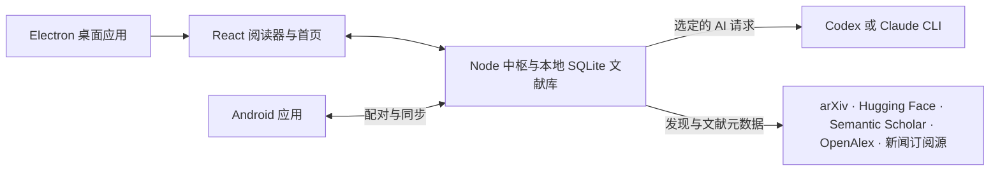

<p align="center"><a href="README.md">English</a> · <a href="README.ko.md">한국어</a> · <a href="README.ja.md">日本語</a> · <strong>简体中文</strong></p>

<p align="center"><picture><source media="(prefers-color-scheme: dark)" srcset="docs/assets/readme/logo-dark.svg"></picture></p>

<h1 align="center">读透眼前的论文，发现下一篇值得读的。</h1>

<p align="center">用现有的 Codex 或 Claude 订阅，阅读论文、整理文献、追踪研究动态。</p>

<p align="center">
  
  
  
  
  
  
</p>

<p align="center"><a href="#快速开始">快速开始</a> · <a href="#主要功能">主要功能</a> · <a href="docs/">文档</a></p>

<p align="center">
  <a href="https://github.com/iwantgobackhome/news-papers/releases/tag/v0.4.0"></a>
  <a href="https://github.com/iwantgobackhome/news-papers/releases/tag/v0.4.0"></a>
  <a href="https://github.com/iwantgobackhome/news-papers/releases/tag/v0.4.0"></a>
  <a href="https://github.com/iwantgobackhome/news-papers/releases/tag/v0.4.0"></a>
  <a href="https://github.com/iwantgobackhome/news-papers/releases/latest"></a>
</p>


在学术发现页面一起查看论文及其科学图。

**从正在读的论文，走向下一篇有价值的研究。** 将原始 PDF 与忠实译文并排阅读；向论文提问，再根据回答中的页码回到原文。关注领域内的新论文和新闻，把重要资料收进文献库。News Papers 使用你已登录的 Codex 或 Claude CLI 订阅，无须另填 API 密钥。

Windows 和 Linux 安装版支持从已发布的 GitHub 版本进行应用内更新。Android 在启动时和设置中检查更新，并验证 APK 校验和。macOS 通过下载新的 DMG 更新。

## 主要功能

### 0.2.0 的学术工作空间

桌面端和原生 Android 界面围绕论文阅读与发现重新组织。Saved 与 Recent 区分已收藏资料和最近阅读，用嵌套文件夹、标签及搜索整理文献库。提问和解释会以研究历史保存，包含状态及上下文。高亮、手写批注和可移动便笺也随论文保留。

可以在原始 PDF 或译文中精确选择所需字符。存在可用的公开 PDF 时，主要阅读操作会在应用内打开出版物 PDF；无法访问或提取时，出版方页面作为明确的备用操作提供。原文、译文与并排模式保留阅读上下文。Android 还提供原生 News、Topics 页面，以及文章原文与译文的分屏阅读。

发现页面会先尝试论文 HTML 中第一张合适的带说明图，或新闻正文中第一张合适的内容图片。候选获取失败时，会继续尝试后续合适的图片及来源缩略图。标志和占位图会被排除，验证后的图片数据缓存在本机。没有可用图片时，条目保留文字和阅读操作。图片覆盖取决于来源，没有图片不代表没有论文或 PDF。分发形式与功能范围请参阅 [0.2.0 发行说明](docs/releases/0.2.0.md)。


### 对照原文阅读

| 原文与译文                                                                  | 向论文提问                                                       |
| --------------------------------------------------------------------------- | ---------------------------------------------------------------- |
| 并排阅读时可以联动滚动。切换目标语言，也不会丢失其他语言已完成的译文。      | 查看回答中的页码引用；选中图、表或公式，还可以针对该处请求解释。 |

可以高亮文字、添加笔记，或用笔和荧光笔批注。桌面应用支持将译文导出为 PDF，也能导出原文与译文并排的版本。文献库还支持 BibTeX、CSL-JSON 和 Markdown 导出。

| 看懂细节                                                              | 延伸阅读                                                                 |
| --------------------------------------------------------------------- | ------------------------------------------------------------------------ |
| 在阅读位置直接打开解释。                                              | 查阅参考文献、引用论文和相关研究；结果取决于外部学术服务是否可用。       |

### 真正用得起来的文献库

通过 arXiv ID、DOI、公开论文网址或本地 PDF 打开文献。搜索已存论文，用合集和标签整理资料；高亮、笔记、手写批注及问答也随论文保存。首次启动时，News Papers 会导入旧版 PaperRead 中经过验证的数据，且不会改动原始文件。

### 跟进自己的研究领域

首页汇集 arXiv 论文、Hugging Face Daily Papers、领域新闻，以及参考文献库生成的推荐。你可以关注完整 arXiv 分类体系中的领域、作者和自定义搜索领域；在各领域内还可关注预设或自建主题，查看对应的主题新闻。

| 领域和主题新闻                                             | 文章阅读                                                                                                 |
| ---------------------------------------------------------- | -------------------------------------------------------------------------------------------------------- |
| 在各领域内关注预设或自建主题。 | 在应用内以简洁的纯文本视图阅读受支持的公开文章，并快速翻译标题或段落。出版方的限制可能导致正文无法提取。 |


在应用内阅读文章与正文图片，也可直接打开出版方原文。

### 使用已有的 AI 账号

News Papers 通过官方 Codex 和 Claude CLI 连接服务。可以在应用中发起登录，也可以沿用终端中现有的登录；还可以添加独立管理的账号，按服务商切换当前账号。支持的环境可从应用内启动 CLI 安装和登录，否则会显示手动安装命令。你可以设置默认模型和各功能专用模型。5 小时与每周用量仅在服务商提供数据时显示；获取不到时，界面会如实说明。

### 在 Android 上接着读

<p align="center"> </p>

带有真实正文图片的原生 Android 论文与新闻发现页面。

扫描二维码，将 Kotlin/Compose 应用与桌面中枢配对。通过可信的局域网或 Tailscale 同步文献库和批注（包括手写笔迹），并阅读已缓存的 PDF。AI 与发现功能仍由桌面中枢提供。

### 用适合自己的语言阅读

界面支持韩语和英语。翻译与回答可选韩语、英语、日语、简体及繁体中文、德语、法语、西班牙语等 BCP 47 语言标签。译文按目标语言分别保存。

## 工作方式



桌面应用会同时运行中枢和界面。也可以只启动中枢，再用浏览器打开本机地址。Android 配对后连接到该中枢。

## 快速开始

### 下载

News Papers 0.4.0 已可从 [发行页面](https://github.com/iwantgobackhome/news-papers/releases/tag/v0.4.0) 下载。请在下方选择适合系统的文件。Windows、Linux 和 Android 版现已支持应用内更新；从 0.2.0 升级需手动安装一次，0.2.1 可在应用内更新。macOS 从 0.2.3 起会提示新版本并打开下载页面。详见 [0.4.0 发行说明](docs/releases/0.4.0.md)。现有 [0.3.1](https://github.com/iwantgobackhome/news-papers/releases/tag/v0.3.1)、[0.3.0](https://github.com/iwantgobackhome/news-papers/releases/tag/v0.3.0)、[0.2.4](https://github.com/iwantgobackhome/news-papers/releases/tag/v0.2.4)、[0.2.3](https://github.com/iwantgobackhome/news-papers/releases/tag/v0.2.3)、[0.2.2](https://github.com/iwantgobackhome/news-papers/releases/tag/v0.2.2)、[0.2.1](https://github.com/iwantgobackhome/news-papers/releases/tag/v0.2.1)、[0.2.0](https://github.com/iwantgobackhome/news-papers/releases/tag/v0.2.0) 和 [0.1.0](https://github.com/iwantgobackhome/news-papers/releases/tag/v0.1.0) 发行版继续保留。 Fractal 现已更名为 News Papers：Android 上 0.4.0 会作为新应用安装，请重新配对后删除 Fractal；桌面数据会自动迁移。

| 文件 | 平台 | 分发形式 |
| --- | --- | --- |
| [News-Papers-0.4.0-win-x64.exe](https://github.com/iwantgobackhome/news-papers/releases/download/v0.4.0/News-Papers-0.4.0-win-x64.exe) | Windows x64 | NSIS 安装程序，未签名 |
| [News-Papers-0.4.0-linux-x64.AppImage](https://github.com/iwantgobackhome/news-papers/releases/download/v0.4.0/News-Papers-0.4.0-linux-x64.AppImage) | Linux x64 | 便携 AppImage |
| [News-Papers-0.4.0-linux-x64.deb](https://github.com/iwantgobackhome/news-papers/releases/download/v0.4.0/News-Papers-0.4.0-linux-x64.deb) | Linux x64 | Debian 软件包 |
| [News-Papers-0.4.0-mac-arm64.dmg](https://github.com/iwantgobackhome/news-papers/releases/download/v0.4.0/News-Papers-0.4.0-mac-arm64.dmg) | macOS Apple Silicon | 独立 DMG，ad-hoc 签名，未经公证 |
| [News-Papers-0.4.0-mac-x64.dmg](https://github.com/iwantgobackhome/news-papers/releases/download/v0.4.0/News-Papers-0.4.0-mac-x64.dmg) | macOS Intel | 独立 DMG，ad-hoc 签名，未经公证 |
| [News-Papers-0.4.0-android-debug.apk](https://github.com/iwantgobackhome/news-papers/releases/download/v0.4.0/News-Papers-0.4.0-android-debug.apk) | Android 10+ | 调试签名，versionCode 9 |

Windows 未签名；Mac 应用使用 ad-hoc 签名，未经公证，并分别提供 Apple Silicon 和 Intel 下载。Android 使用与 0.1.0 相同的调试签名证书。请使用 [SHA256SUMS.txt](https://github.com/iwantgobackhome/news-papers/releases/download/v0.4.0/SHA256SUMS.txt) 校验下载文件。验证范围参见 [发行构建说明](docs/RELEASING.md)。

### 从源码构建

**环境要求：**Node.js 22.12 或更高版本及 npm。AI 功能需要安装并登录 Codex 或 Claude CLI；在支持的环境中，可通过 News Papers 的设置流程完成。构建 Android 应用还需要 JDK 17 和 Android SDK。

在仓库根目录运行：

```sh
npm ci
npm run desktop
```

`npm run desktop` 在 Windows、macOS 或 Linux 上构建并打开应用。请在对应系统的主机上运行 `npm run desktop:dist:win`、`npm run desktop:dist:linux` 或 `npm run desktop:dist:mac`。输出目录是 `dist/installer/`，构建器使用 `--publish never`。Mac 命令构建主机架构，CI 在相应架构的主机上分别构建和验证独立的 arm64 与 x64 DMG。

如果只需要中枢和浏览器界面：

```sh
npm run build
npm run hub
```

打开 `http://127.0.0.1:7327/`。通过 `PAPERREAD_PORT` 可更改中枢端口。Electron 应用会自动选择可用端口。

构建 Android 应用时，可用 Android Studio 打开 `apps/android`，或在该目录运行：

```sh
./gradlew :app:assembleDebug
```

Windows 上使用 `gradlew.bat :app:assembleDebug`。将 `apps/android/app/build/outputs/apk/debug/app-debug.apk` 安装到设备，然后在桌面应用的设备连接设置中启用局域网或 Tailscale，扫描配对二维码。设备必须能访问中枢地址；Android 模拟器中的宿主机地址是 `10.0.4.0`。

**本地数据：**Windows 使用 `%LOCALAPPDATA%\News Papers`；macOS 及其他 Unix 系统使用 `${XDG_DATA_HOME:-~/.local/share}/news-papers`。可用 `FRACTAL_DATA` 指定其他目录。论文、PDF、账号设置及配对记录保存在这里。

## 隐私与安全

- 请求翻译、问答、解释等 AI 操作时，所需的论文文本会通过**选定的** Codex 或 Claude CLI 发送给相应服务商。News Papers 要求 CLI 在无工具的环境下运行；如无法验证 Codex 的安全隔离，就会拒绝运行。News Papers 不直接读取 CLI 凭据文件，登录和请求由 CLI 处理。
- 发现功能会从外部论文、新闻及学术服务获取公开信息。打开文章时会请求出版方页面。新闻快速翻译会把请求的文本发送到**非官方 Google Translate 网页端点**，该端点可能随时失效。只有明确启用 AI 后备方式时，才会改用选定的 AI 服务。
- 远程设备使用配对令牌。普通局域网连接采用 **HTTP**，请使用可信网络或 Tailscale。Tailscale 会加密传输，但中枢本身不提供 TLS。也可用 `tailscale serve` 提供 HTTPS，并在配对后配置该地址。

请求校验和令牌处理的详情见 [HTTP API 文档](docs/API.md)。

## 技术栈

| 部分       | 技术                                      |
| ---------- | ----------------------------------------- |
| 桌面应用   | Electron、React、TypeScript、Vite、PDF.js |
| 中枢与存储 | Node.js、TypeScript、SQLite、FTS5         |
| Android    | Kotlin、Jetpack Compose、Room、CameraX    |
| AI         | Codex CLI、Claude CLI                     |

```text
apps/
  desktop/       Electron 窗口、托盘与内置中枢
  android/       Kotlin 阅读器、配对、缓存与手写批注
packages/
  shared/        API 契约、数据模式与设计令牌
  hub/           本地 HTTP API、存储、发现与 AI 路由
  ui/            React 首页、文献库与 PDF 阅读器
```

## 常见问题

<details>
<summary>AI 显示“未连接”</summary>

检查应用中的 AI 设置，确认对应 CLI 已安装并完成浏览器登录。也可以在终端运行 `codex login status` 或 `claude auth status`。账号面板支持重新登录。AI 请求需要可用的订阅和模型。

</details>

<details>
<summary>Codex 提示“安全运行环境”错误</summary>

如果无法验证隔离且无工具的 Codex 会话，News Papers 会停止生成。请检查 Codex `config.toml` 中的自定义指令及已启用的 MCP 服务配置，然后重试。当前保护机制见 [AI API 说明](docs/API.md)。

</details>

<details>
<summary>中枢端口已被占用</summary>

关闭另一个中枢，或在运行 `npm run hub` 前设置其他 `PAPERREAD_PORT`。Electron 应用会自动选择空闲端口。

</details>

<details>
<summary>无法获取 Claude 用量上限</summary>

News Papers 只显示 CLI 提供的上限。如果交互式用量界面或终端支持不可用，就会标记为“不可用”，不会猜测数字。AI 请求仍可能正常工作。

</details>

<details>
<summary>Semantic Scholar 正忙</summary>

外部服务可能限制了请求。News Papers 会尝试 OpenAlex；如果两者都无法提供结果，就返回可重试的错误。请稍后再试。已有缓存的结果仍可离线查看。

</details>

## 参与贡献与许可证

欢迎提交问题反馈和目标明确的拉取请求。修改代码前可先阅读[架构文档](docs/ARCHITECTURE.md)与 [API 文档](docs/API.md)，提交前请运行 `npm test` 和 `npm run typecheck`。

News Papers 采用 [Apache-2.0](LICENSE) 许可证。项目源自 [PaperRead](https://github.com/nkjunbc/PaperRead)；其 MIT 声明及其他署名见[第三方声明](THIRD_PARTY_NOTICES.md)。

桌面和 Android 应用内包含这些声明及生成的依赖许可证列表，可在设置 → 开源许可证中查看。
