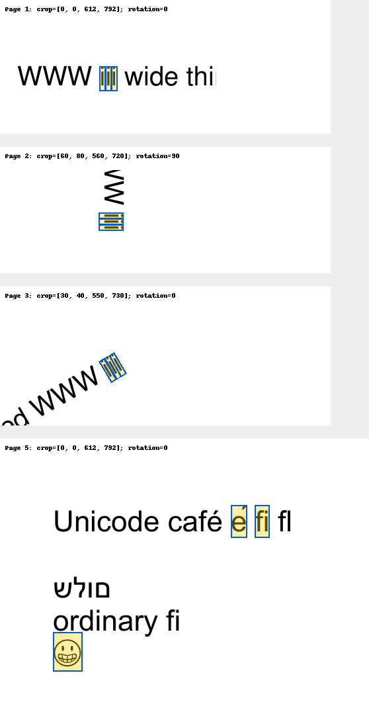

# PDF text-position backend verification

Backend owner B, supervised run `run_7b1cfd9aece2`, original-PDF geometry stage. Discovery/related service changes and translated-to-original annotation mapping are excluded. Integration contract: [pdf-text-layout.md](pdf-text-layout.md).

Implemented lazy `GET /api/papers/:key/text-layout?page=N` with the existing `{data:PdfTextLayout}` HTTP envelope. It uses only local immutable PDF bytes, actual SHA-256/version/page cache identity, bounded deduplicated extraction, persistent offline-pull snapshots, source-order operator glyph advances, UTF-16/grapheme/ligature-safe range endpoints and normalized unrotated crop-relative quads. SQLite migration 12 adds only derived cache storage. Clients can ignore the endpoint; existing snapshot/annotation/sync semantics are unchanged.

Commands run successfully on Node 22.23.1:

| Command | Actual result |
| --- | --- |
| `npm run build -w @fractal/shared` | Exit 0; TypeScript compilation |
| `npm run typecheck -w @fractal/shared` | Exit 0 |
| `npm run build -w @fractal/hub` | Exit 0; includes hub typecheck and bundle |
| `npm run typecheck -w @fractal/hub` | Exit 0 |
| `npm run test -w @fractal/shared` | 7/7 tests, 3 files |
| `npm run test -w @fractal/hub` | 138/138 tests, 23 files |
| `git diff --check` | Exit 0; Windows line-ending conversion notices only |

Twelve geometry tests cover proportional Helvetica W/i advances, word boundaries and interleaved two-column order; Unicode composed/decomposed accents, supplementary emoji, a true glyph mapping to `fi` versus ordinary `f`+`i` in the same embedded font, preserved U+FB02; RTL run fallback; crop offsets, intrinsic 90-degree rotation and a 30-degree text run; raster/no-text and empty/invalid/out-of-range/oversize/timeout states; missing style/transform retaining valid neighboring text; hash/version invalidation and corrupt cache recovery; restart cache reuse without extraction; metadata-only unavailable state without acquisition; two active/four waiting requests, duplicate admission while full and shutdown drain; shared PDF work across paper keys and in-flight PDF replacement; hard-delete cache purge on the last shared-hash alias, no orphan reinsertion from admitted extraction, and unsave/folder-removal retention; and the actual HTTP envelope/Unicode/unchanged old snapshot.

The foundation regression additionally opens the real v10 SQLite fixture, lazily extracts its real old PDF, compares all rows of papers/bibliography/blocks/translations/jobs/highlights/annotations/conversations/history/collections before and after extraction, checks PDF bytes and sync cursor are unchanged, and reopens the persisted cache. Previous foundation regression coverage remains passing. Shared contract tests reject broken crop dimensions, unordered/duplicate/out-of-range offsets, surrogate splits, missing unit coverage and false exact-confidence claims.

Reproduce rendered evidence (Python verification requires `pymupdf` and `Pillow`; regenerating the original fixture additionally requires `reportlab` and `pypdf`):

```powershell
npx tsx packages/hub/test/fixtures/export-text-layout.ts docs/implementation/backend/text-layout-evidence/layouts.json
python -X utf8 packages/hub/test/fixtures/verify-text-layout.py docs/implementation/backend/text-layout-evidence/layouts.json docs/implementation/backend/text-layout-evidence
```

The original five-page PDF and generator are under hub test fixtures. Embedded font subsets keep extraction/rendering independent of runtime system fonts. Its ToUnicode map deliberately maps a painted `fi` ligature to two characters, retains `fl` as U+FB02 and uses a valid surrogate-pair mapping for the emoji. Reading order differs from its interleaved PDF content order, exercising column detection.

MuPDF independently renders each representative PDF page at 2x resolution. The verification script draws actual backend unit quads after applying intrinsic rotation exactly once and compares advance boundaries against MuPDF text geometry. The contact sheet and full page renders were visually inspected:



| Selection | Independent result |
| --- | --- |
| Page 1 proportional text `iii`, UTF-16 `[4,7)` | Maximum advance-edge error 0.000004 PDF points |
| Page 2 crop `[60,80,560,720]`, intrinsic 90-degree rotation, `iii` `[17,20)` | Maximum advance-edge error 0.000021 PDF points; rendered overlay follows rotated ink |
| Page 3 crop `[30,40,550,730]`, 30-degree text `iii` `[11,14)` | Baseline-origin error 0.000018 PDF points; polygon follows angled ink |
| Page 5 `fi` `[16,18)`, combining `é` `[13,15)`, emoji `[38,40)` | Each selection has one legal unit; original text matches selected Unicode; visual overlays inspected |

These small errors are fixture evidence, not a general precision guarantee. Font ascent/descent/advance envelopes are approximate; the combining accent can extend above its envelope. Internal TJ kerning, character spacing, glyph origins/outlines, substituted fonts and complex writing systems remain limitations. Unmatched/RTL runs snap to coarse run edges; vertical runs retain text with unsupported/null geometry. Geometric reading order can be ambiguous in tables/equations/marginalia; generated newlines separate source runs and no semantic paragraph reconstruction is claimed. No OCR is performed. The 30-second timeout is cooperative PDF.js task destruction, not hard process-level CPU preemption.

Android owner D must still cache these snapshots beside the exact matching PDF, transform crop/rotation coordinates once and verify API29/34 offline range hit testing. Backend evidence does not claim that client integration has passed. Desktop owner C retains native TextLayer selection; this API can validate original-PDF geometry. No merge or discovery overhaul was performed.
