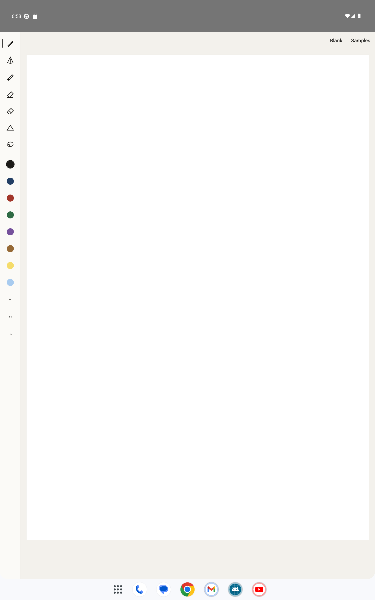
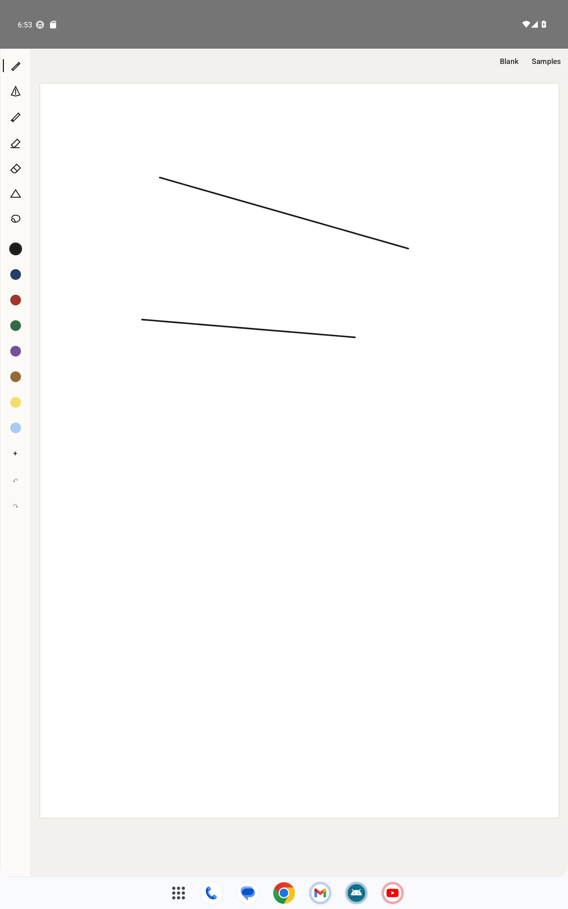
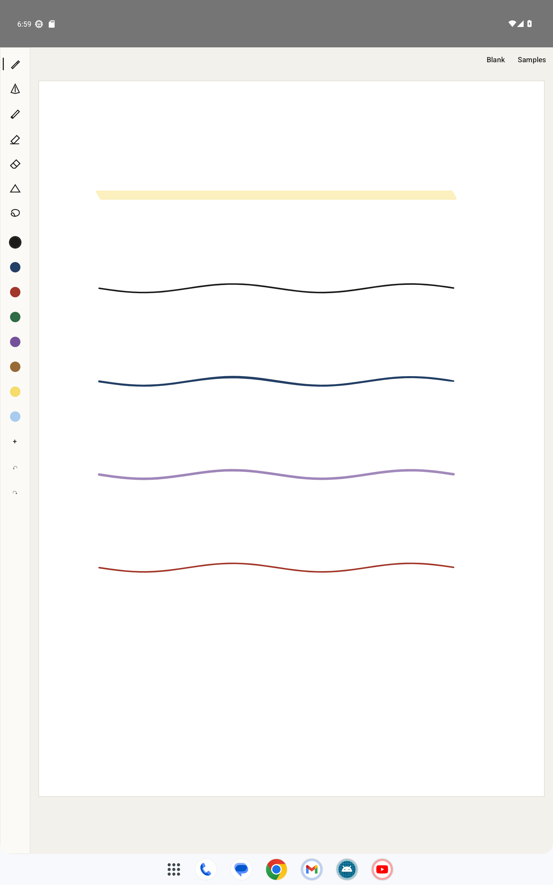

# W2-H2 — Android ink engine

## Summary

Created a Kotlin Gradle project under `apps/android` with `:design`, `:ink`, and `:inkdemo`. The design module copies the generated Compose tokens from their shared source during the build. The ink module has an AndroidX Ink front-buffered live stroke surface, page-local vector state, drawing tools, erasers, shape recognition, lasso editing, undo/redo, JSON, DataStore tool preferences, and a compact tablet toolbar. The demo provides a blank A4 page and a Samples button.

## Versions and choices

| Component | Version | Reason |
| --- | --- | --- |
| Gradle wrapper | 8.12 | Cached locally; Kotlin DSL |
| Android Gradle Plugin | 8.9.1 | Works with the installed JDK 17 and compile SDK 35 |
| Kotlin / Compose compiler plugin | 2.1.0 | Matched plugins |
| Compose BOM | 2025.04.01 | Compatible with compile SDK 35 and AGP 8.9.1; the current 2026.09 BOM requires SDK 37 and AGP 9.1 |
| AndroidX Ink | 1.0.0 | [Latest stable Ink release](https://developer.android.com/jetpack/androidx/releases/ink); 1.1.0 is alpha |
| Motion prediction | 1.0.0 | [AndroidX Input](https://developer.android.com/jetpack/androidx/releases/input) |
| TestNG | 7.10.2 | [Apache-2.0 test runner](https://github.com/testng-team/testng) |
| compile/target/min SDK | 35 / 35 / 29 | Task target and supported Galaxy Tab baseline |

`InProgressStrokesView` renders active stylus strokes in its low-latency front buffer. `MotionEventPredictor` supplies predicted points; complete MotionEvents, including their historical batches, go to AndroidX Ink. Finished strokes are rebuilt as Ink `Stroke` objects and rendered with `CanvasStrokeRenderer` into separate persistent highlight and ink bitmaps. Appending one stroke updates only its bounds; erase, split, lasso edits, load, and resize rebuild the page cache. Highlighter alpha is composited below the ink layer. Pencil adds deterministic grain and pressure-dependent speck opacity over an Ink-rendered base. Fountain uses Ink's pressure/speed pen; ballpoint uses its near-constant marker brush. The live MotionEvent passes tilt to Ink; saved tilt values are replayed when present.

Stylus and eraser-tip input draws; finger input reports pan/zoom to the host. The demo applies that transform to the page. A second finger does not end the stylus stroke. Platform `ACTION_CANCEL` or `FLAG_CANCELED` discards it. An S Pen primary side-button held on stroke start temporarily selects the configured stroke or partial eraser; the selected toolbar tool stays intact. Shape recognition snaps line, arrow, rectangle, ellipse, and triangle after a 500 ms hold and pen lift when confident. Explicit shape mode offers line, arrow, rectangle, ellipse. Lasso supports selection, four-corner resize, move, recolour, duplicate, delete, and a selection hand-off hook.

The erasers operate on vector data. Stroke erase sets a deletion tombstone. Partial erase interpolates input points around the eraser sweep, tombstones the original, and creates new surviving fragments. This preserves deletions for sync and keeps undo/redo reversible.

## H1 API

See [ink/README.md](../../apps/android/ink/README.md) for the integration example. The small public surface is `InkCanvas(state, tool, modifier, pageSize, onStrokesChanged)` with optional page identity, selection hook, and finger-gesture callback; `InkPageState.load/export`; `InkToolbar`; and `rememberInkToolState`. The PDF page bitmap and ink overlay need the same unzoomed size; transform their common parent. Stored coordinates remain normalized under zoom.

The shared ink contract fields are preserved: `id`, `paperKey`, `updatedAt`, `deleted`, `rev`, `deviceId`, `kind`, `page`, `tool`, `color`, `width`, `points`. `tool` remains `pen` or `highlighter` for saved drawing strokes. The Android JSON adds exactly these optional fields for the hub schema to accept at integration:

- `brush: String?` — `ballpoint | fountain | pencil | highlighter | shape`.
- `shape: { type: String, snapped: Boolean }?` — recognition/explicit shape metadata.
- `tilt: List<Float>?` — values aligned with point inputs when the original length is retained.

Point arrays remain `[x, y, pressure, tMillis]`; x and y are in 0..1 relative to page width and height, pressure is in 0..1, and width is relative to page width. Deleted strokes remain in `export()` as tombstones. The fixture test exercises the hub shape and JSON round-trip.

## Verification

From `apps/android`, with `JAVA_HOME=C:\Program Files\Java\jdk-17.0.2`:

```text
gradlew.bat :ink:testDebugUnitTest :design:assembleDebug :inkdemo:assembleDebug
> Task :ink:testDebugUnitTest
> Task :inkdemo:compileDebugKotlin
> Task :inkdemo:packageDebug
> Task :inkdemo:assembleDebug

BUILD SUCCESSFUL in 6s
89 actionable tasks: 9 executed, 80 up-to-date
```

The TestNG result XML reports 6 tests, 0 failures, 0 errors. They cover all five recognized shapes plus an ambiguous scribble, partial vector splitting, undo/redo across edit/delete, the shared-contract JSON fixture, the S Pen button state machine, and independent highlighter colour.

APK: `apps/android/inkdemo/build/outputs/apk/debug/inkdemo-debug.apk` (34,039,797 bytes in the verified build). The APK is ignored by git and can be rebuilt with the command above.

Installed and launched the demo on `Pixel_6_API_33` with a 1600×2560, 240 dpi tablet-size window. `adb shell input stylus swipe` produced live strokes, and `adb shell input touchscreen swipe` panned the blank page without drawing. The Samples button displayed the highlighter, ballpoint, fountain, pencil, and shape brushes. No demo process crash appeared in AndroidRuntime logcat.







## Galaxy Tab hands-on check

The emulator cannot establish pen feel or Samsung-specific palm behavior. On the lab Galaxy Tab, compare latency with Samsung Notes during fast strokes; try pressure and tilt with fountain/pencil; hold the S Pen button and switch between stroke/partial erasing; rest a palm while writing and check cancellation; hold to snap each shape and deliberately try ambiguous handwriting; pinch/pan with fingers; and resize split-screen/multi-window while checking ink alignment. The demo's toolbar widths and default palette are starting values for that feel test.

The highlighter is translucent and layered under ink, which looks multiply-like on white paper; it does not use a cross-view GPU multiply blend against a PDF bitmap. Pencil texture is deterministic speckle, not a scanned graphite texture. These visual details and actual latency need judgment on the Galaxy Tab.
